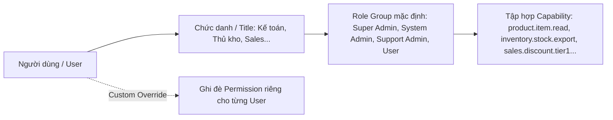

# ADR-0006: Xác thực Server Session & Phân quyền Capability

## 1. Metadata

- **Mã:** ADR-0006
- **Trạng thái:** `Accepted`
- **Ngày quyết định:** 2026-08-22
- **Tác giả:** System Architect / AI Bot 1
- **Tham chiếu:** `AGENTS.md` (Mục 3 & 4), `docs/requirements/role-management.md`, `docs/decision-backlog.md` (DEC-001)

---

## 2. Context & Problem Statement

Trong hệ thống quản lý doanh nghiệp vật liệu xây dựng, phân quyền và kiểm soát quyền truy cập là nền tảng cốt lõi:
- Cần kiểm soát chặt chẽ ai được duyệt chiết khấu, ai được xuất kho, ai được sửa giá vốn, ai được xem báo cáo lợi nhuận.
- Các mô hình phân quyền dựa trên JWT Stateless (Client lưu token) thường gặp vấn đề: Khó thu hồi quyền tức thời khi nhân viên bị khóa tài khoản hoặc chuyển vai trò (chờ JWT hết hạn mới có hiệu lực); kích thước token lớn khi nhét nhiều claim quyền; rủi ro rò rỉ token qua XSS nếu lưu `localStorage`.
- Hard-code quyền theo chức danh kinh doanh (`if (user.title === 'Giám đốc')`) là một anti-pattern khiến hệ thống bị cứng nhắc và không thể tùy biến quyền cho các cửa hàng khác nhau.

Cần một kiến trúc xác thực an toàn tuyệt đối, có thể thu hồi session tức thì và hệ thống phân quyền linh hoạt theo năng lực (Capability-based).

---

## 3. Decision Drivers

- Khả năng thu hồi session đăng nhập ngay lập tức (Instant Session Invalidation) khi nhân viên nghỉ việc hoặc đổi mật khẩu.
- Bảo vệ chống tấn công XSS và CSRF.
- Tách biệt giữa **Chức danh kinh doanh (Title)**, **Nhóm quyền hệ thống (Role Group)** và **Quyền hạn chi tiết (Capabilities/Permissions)** theo định hướng CEO.
- Kiểm tra quyền ở Backend độc lập và không tin cậy bất kỳ claim nào gửi từ Frontend.

---

## 4. Considered Options

- **Option A: Stateless JWT lưu tại localStorage:** Dễ triển khai nhưng không an toàn trước XSS, không thu hồi được token ngay lập tức nếu không có blacklist phức tạp.
- **Option B: Server-side Opaque Session Token trong Cookie `HttpOnly` (Chọn):**
  - Trình duyệt chỉ lưu một chuỗi ngẫu nhiên có độ dài lớn (Opaque Token) trong Cookie an toàn `HttpOnly; Secure; SameSite=Lax`.
  - Toàn bộ thông tin phiên (`user_id`, `tenant_id`, `permissions`, `expires_at`) được lưu tại Backend (Database/Redis).
  - Thu hồi phiên tức thì bằng cách xóa dòng session trong database.
- **Option C: OAuth2 / OIDC qua Identity Provider bên thứ ba (Auth0/Clerk):** Tăng chi phí thuê bao SaaS bên ngoài, khó tích hợp sâu với cơ chế Multi-tenancy và mô hình Role Group đặc thù ngành VLXD.

---

## 5. Decision Outcome

**Chọn Option B: Sử dụng Server-Side Opaque Sessions kết hợp Cơ chế Phân quyền theo Capability (Capability-Based Authorization).**

### 1. Cơ chế Xác thực (Authentication):
- Đăng nhập thành công $\rightarrow$ Backend sinh chuỗi `session_token` ngẫu nhiên (64 ký tự hex) $\rightarrow$ Lưu vào bảng `sessions` (có `user_id`, `tenant_id`, `ip`, `user_agent`, `expires_at`).
- Backend gửi cookie về client: `Set-Cookie: vlxd_session=...; HttpOnly; Secure; SameSite=Lax; Path=/`.
- Mỗi request gửi lên $\rightarrow$ Fastify Auth Hook truy vấn session từ database/cache $\rightarrow$ Xác thực danh tính.

### 2. Mô hình Phân quyền 3 Tầng (Authorization Model):


- **Backend Route Guard:** Backend kiểm tra theo Capability:
  ```typescript
  // Fastify route guard
  fastify.get('/products', { preHandler: [requirePermission('product.item.read')] }, handler);
  ```

---

## 6. Consequences

### Positive Consequences
- **An toàn XSS & CSRF:** Cookie `HttpOnly` ngăn ngừa JavaScript truy cập token; `SameSite=Lax` chặn hầu hết các cuộc tấn công CSRF.
- **Instant Revocation:** Đổi mật khẩu hoặc vô hiệu hóa user sẽ lập tức hủy toàn bộ session của user đó trên mọi thiết bị.
- **Linh hoạt phân quyền:** Cửa hàng có thể điều chỉnh quyền chi tiết cho từng nhân viên mà không cần sửa code.

### Negative Consequences & Mitigations
- *Database query trên mỗi request:* Cache session trong bộ nhớ đệm (hoặc Redis) và set TTL hợp lý để giảm tải database.

---

## 7. Compliance & Enforcement

- Tuyệt đối cấm Frontend lưu trữ token xác thực trong `localStorage` hoặc `sessionStorage`.
- Tuyệt đối cấm kiểm tra quyền bằng chuỗi chức danh (Title). Mọi route backend bắt buộc kiểm tra theo mã `permission` (Capability).
