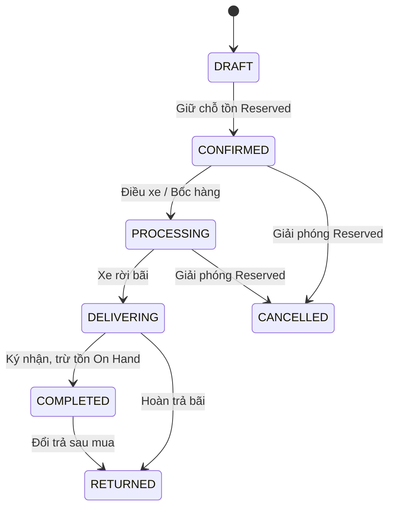

# ADR-0007: Sổ cái Bất biến (Immutable Ledgers) & State Machines

## 1. Metadata

- **Mã:** ADR-0007
- **Trạng thái:** `Accepted`
- **Ngày quyết định:** 2026-08-22
- **Tác giả:** System Architect / AI Bot 1
- **Tham chiếu:** `AGENTS.md` (Mục 0 & 4.1), `docs/decision-backlog.md` (DEC-003, DEC-005, DEC-006, DEC-007)

---

## 2. Context & Problem Statement

Trong các ứng dụng quản lý kho hàng và tài chính truyền thống, việc cập nhật trực tiếp số dư (ví dụ: `UPDATE products SET stock = stock - 5`) hoặc cập nhật trực tiếp công nợ là một sai lầm kiến trúc tai hại:
- Khi có sự cố sai lệch số liệu (Discrepancy), hoàn toàn không thể truy vết được số tồn hoặc số nợ đó bị thay đổi bởi giao dịch nào, vào lúc nào, bởi ai.
- Thao tác xóa cứng record (`DELETE FROM orders`) làm mất hoàn toàn chứng từ kiểm toán, gây rủi ro thất thoát hàng trăm triệu đồng vật tư và tiền bạc.
- Không kiểm soát được trạng thái đơn hàng khi các tiến trình xử lý song song diễn ra (như vừa hủy đơn vừa xuất hàng).

Cần một kiến trúc Sổ cái Bất biến (Immutable Append-Only Ledger) và Máy trạng thái hữu hạn (Finite State Machine) nghiêm ngặt để đảm bảo toàn vẹn dữ liệu kế toán và kho bãi.

---

## 3. Decision Drivers

- Truy vết toàn diện (Full Auditability) mọi biến động hàng tồn và công nợ.
- Không thể chối bỏ (Non-repudiation) và không thể giả mạo số liệu lịch sử.
- Ngăn chặn triệt để các bước chuyển trạng thái đơn hàng phi lý hoặc bỏ cóc.
- Hỗ trợ khôi phục, đối soát và đối chiếu số dư tức thời với tổng lịch sử giao dịch.

---

## 4. Considered Options

- **Option A: Direct State Mutation (Truyền thống):** Lưu số dư trực tiếp trong bảng sản phẩm/khách hàng và cập nhật đè (`UPDATE`). (Bị loại vì rủi ro mất dấu vết giao dịch, không đạt tiêu chuẩn kiểm toán).
- **Option B: Event Sourcing thuần túy:** Lưu toàn bộ hệ thống dưới dạng stream of events. (Quá phức tạp đối với bài toán CRUD thông thường, query phức tạp, chi phí bảo trì cao).
- **Option C: Sổ cái Kép Bất biến (Append-Only Ledgers) + Snapshot Cân bằng Tức thời + Finite State Machine (Chọn):**
  - Mọi thay đổi kho ghi vào `inventory_ledger`.
  - Mọi thay đổi công nợ ghi vào `debt_ledger`.
  - Bảng số dư tức thời (`inventory_balances`, `customer_balances`) đóng vai trò snapshot đọc nhanh, được cập nhật trong cùng transaction với dòng ledger.
  - Vòng đời chứng từ được kiểm soát bằng State Machine bất biến ở Backend.

---

## 5. Decision Outcome

**Chọn Option C: Áp dụng Sổ cái Bất biến cho Kho và Công nợ kết hợp với Finite State Machine cho Đơn hàng & Vận chuyển.**

### 1. Sổ cái Kho Bất biến (`inventory_ledger`):
- Các loại sự kiện: `IMPORT`, `EXPORT`, `RESERVE`, `UNRESERVE`, `TRANSFER_OUT`, `TRANSFER_IN`, `STOCK_ADJUSTMENT`, `RETURN_IMPORT`.
- Cấm tuyệt đối câu lệnh `UPDATE` hoặc `DELETE` trên bảng `inventory_ledger`.
- Mọi điều chỉnh hoặc hủy phiếu đều sinh dòng giao dịch bù trừ (Reverse Entry).

### 2. Sổ cái Công nợ Kép (`debt_ledger`):
- Quản lý theo cơ chế ghi nợ (`DEBIT`) và ghi có (`CREDIT`).
- Dư nợ = $\sum \text{DEBIT} - \sum \text{CREDIT}$.

### 3. Finite State Machine (FSM):

---

## 6. Consequences

### Positive Consequences
- **Kiểm toán Hoàn hảo:** Bất kỳ lúc nào cũng có thể kiểm tra: $\text{Số dư hiện tại} = \sum \text{Dòng ledger}$. Sai lệch được phát hiện ngay lập tức.
- **Không sợ mất dữ liệu:** Xóa nhầm hoặc thao tác sai đều có thể truy vết và lập bút toán đảo dấu để cân bằng lại sổ sách.
- **An toàn Concurrency:** Dễ dàng khóa dòng trên bảng balance để đảm bảo transaction ACID.

### Negative Consequences & Mitigations
- *Dung lượng bảng ledger tăng theo thời gian:* Thiết lập Partitioning theo thời gian (theo năm) trên PostgreSQL cho các bảng `inventory_ledger` và `debt_ledger`.

---

## 7. Compliance & Enforcement

- Database Trigger chặn câu lệnh `UPDATE` và `DELETE` trên bảng `inventory_ledger` và `debt_ledger`.
- Backend Service ném lỗi `INVALID_STATE_TRANSITION` nếu client gửi request chuyển đổi trạng thái không nằm trong đồ thị State Machine.
