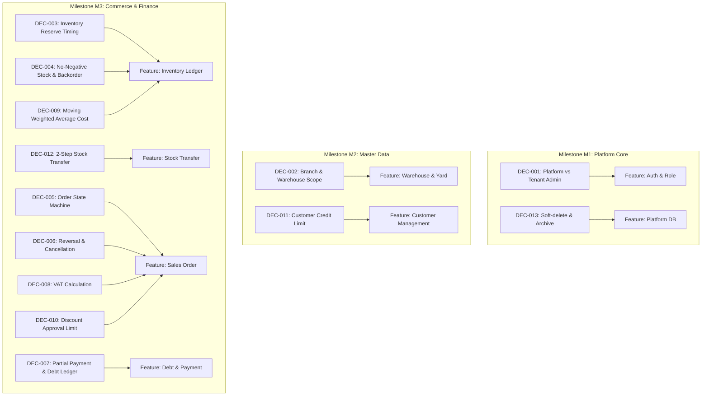

# Decision Backlog — Danh mục Quyết định Nghiệp vụ & Kiến trúc

> Nguồn sự thật quản trị các quyết định kiến trúc, vận hành và nghiệp vụ cho hệ thống `vlxd`.
> Được thiết lập theo yêu cầu tại `TASK-002` (`docs/tasks/MVP-BACKLOG.md`).
>
> **Quy tắc SLA:** Mọi quyết định ở trạng thái `Open` bắt buộc phải có **`Temporary Assumption` (Giả định tạm thời)** an toàn để không chặn tiến độ kỹ thuật. Human Owner sẽ chốt trong vòng **≤ 2 ngày làm việc**; quá hạn sẽ áp dụng giả định tạm thời cho đến khi có quyết định chính thức. AI bot **tuyệt đối không** tự chuyển `Open` thành `Accepted`.

---

## 1. Bảng tóm tắt danh mục quyết định

| ID | Quyết định | Phân loại | Trạng thái | Owner | Trigger / Milestone | Blocker cho Feature |
| --- | --- | --- | --- | --- | --- | --- |
| **DEC-001** | Platform Admin vs Tenant Admin Scope | Kiến trúc / Auth | `Accepted` | CEO / Architect | M1 (TASK-009, 010a) | `auth`, `role-management`, `service-plan` |
| **DEC-002** | Branch & Multi-Warehouse Scope | Nghiệp vụ / Core | `Open` (Assumption) | CEO / Ops Lead | M2 (TASK-014a, 015) | `warehouse`, `inventory` |
| **DEC-003** | Thời điểm Reserve và Trừ Tồn kho | Nghiệp vụ / Ledger | `Open` (Assumption) | CEO / Warehouse Lead | M3 (TASK-016a, 018a) | `inventory`, `order`, `pos` |
| **DEC-004** | Cho phép Xuất âm & Xử lý Đơn đặt trước (Backorder) | Nghiệp vụ / Kho | `Open` (Assumption) | CEO / Sales Lead | M3 (TASK-016b, 018b) | `inventory`, `order` |
| **DEC-005** | State Machine và Vòng đời Đơn hàng | Nghiệp vụ / Bán hàng | `Open` (Assumption) | CEO / Sales Lead | M3 (TASK-018a, 018c) | `order`, `invoice`, `pos` |
| **DEC-006** | Chính sách Hủy chứng từ, Hoàn tác & Ghi sổ bù trừ | Nghiệp vụ / Ledger | `Accepted` | CEO / Accountant | M3 (TASK-016c, 018d) | `inventory`, `order`, `finance` |
| **DEC-007** | Thanh toán từng phần & Quản lý Sổ nợ Công nợ | Nghiệp vụ / Tài chính | `Open` (Assumption) | CEO / Accountant | M3 (TASK-018e, 020a) | `order`, `customer`, `supplier`, `finance` |
| **DEC-008** | Xử lý Thuế VAT trên Báo giá và Đơn hàng | Nghiệp vụ / Thuế | `Open` (Assumption) | CEO / Accountant | M3 (TASK-018b, 018e) | `product`, `order`, `invoice` |
| **DEC-009** | Phương pháp Tính giá vốn Hàng tồn kho | Kế toán / Kho | `Open` (Assumption) | CEO / Accountant | M3 (TASK-016a, 021) | `inventory`, `report`, `finance` |
| **DEC-010** | Phân cấp Phê duyệt Chiết khấu & Giảm giá | Nghiệp vụ / Bán hàng | `Open` (Assumption) | CEO / Sales Lead | M3 (TASK-018a, 018b) | `order`, `role-management` |
| **DEC-011** | Kiểm soát Hạn mức Công nợ Khách hàng (Credit Limit) | Nghiệp vụ / Rủi ro | `Open` (Assumption) | CEO / Risk Lead | M2 / M3 (TASK-017, 018a) | `customer`, `order` |
| **DEC-012** | Quy trình Chuyển kho Nội bộ (Stock Transfer) | Nghiệp vụ / Kho | `Open` (Assumption) | CEO / Warehouse Lead | M3 (TASK-016d) | `warehouse`, `inventory` |
| **DEC-013** | Chính sách Lưu trữ, Soft-delete & Archive Dữ liệu | Kỹ thuật / DB | `Accepted` | Architect | M1 / M4 (TASK-008a, 025) | Toàn bộ các module |

---

## 2. Chi tiết từng quyết định

### DEC-001 — Platform Admin vs Tenant Admin Scope

- **Bối cảnh:** Cần phân tách rõ quyền hạn giữa đội ngũ quản trị nền tảng SaaS (`vlxd`) và người dùng quản trị cửa hàng/doanh nghiệp thuê bao.
- **Các phương án:**
  - *Option A:* Gộp chung 1 bảng role, dùng flag `is_superadmin` trên bảng `users`.
  - *Option B (Chọn):* Tách biệt rõ ràng ở cấp dữ liệu: Platform Super Admin quản trị tenant, billing, hạn mức gói; Tenant Admin (Chủ cửa hàng) chỉ quản trị người dùng, chi nhánh, phân quyền trong phạm vi tenant của mình.
- **Recommendation:** Option B.
- **Trạng thái:** `Accepted`.
- **Ghi nhận quyết định:** Đã quy định tại `/AGENTS.md` (mục 4 & 6). Backend enforce phân quyền theo capability và tenant isolation.

---

### DEC-002 — Branch & Multi-Warehouse Scope

- **Bối cảnh:** Cửa hàng vật liệu xây dựng thường có bãi chứa chính, bãi phụ và các cửa hàng/chi nhánh bán lẻ.
- **Các phương án:**
  - *Option A (Đơn giản):* Mỗi chi nhánh chỉ có duy nhất 1 kho vật lý (quan hệ 1-1).
  - *Option B (Linh hoạt):* Một công ty (Tenant) có nhiều Chi nhánh; mỗi Chi nhánh sở hữu hoặc liên kết 1 hoặc nhiều Kho/Bãi vật liệu (quan hệ 1-N).
- **Recommendation:** Option B để phản ánh đúng thực tế cửa hàng VLXD (1 chi nhánh có thể có bãi cát đá riêng và kho xi măng/sắt thép kế bên).
- **Trạng thái:** `Open`.
- **Temporary Assumption:** Áp dụng mô hình Tenant $\rightarrow$ Chi nhánh (Branch) $\rightarrow$ Kho (Warehouse/Yard). Dữ liệu tồn kho được lưu và quản lý theo cấp độ từng Kho cụ thể. Gói Free/Standard giới hạn 1 kho; gói Premium/Enterprise không giới hạn.
- **Blocker:** M2 (`TASK-014a`, `TASK-015`).

---

### DEC-003 — Thời điểm Reserve và Trừ Tồn kho

- **Bối cảnh:** Khi nhân viên tạo đơn hàng bán, tồn kho có bị trừ ngay hay chỉ giữ chỗ tạm thời?
- **Các phương án:**
  - *Option A:* Trừ tồn kho thực tế ngay khi tạo Đơn hàng ở trạng thái bất kỳ. (Rủi ro: Khách chưa lấy hàng hoặc hủy đơn sẽ làm sai lệch tồn thực tế tại bãi).
  - *Option B (Chọn):* Tách bạch giữa **Tồn thực tế (`on_hand`)** và **Tồn khả dụng (`available = on_hand - reserved`)**. Khi Đơn hàng được Xác nhận (`CONFIRMED`), hệ thống tăng `reserved`. Khi phiếu Xuất kho được thực thi (`DELIVERING` / `COMPLETED`), hệ thống trừ `on_hand` và giảm `reserved`.
- **Recommendation:** Option B đảm bảo tính chính xác và không bị bán trùng (oversell) khi nhiều nhân viên cùng chốt đơn.
- **Trạng thái:** `Open`.
- **Temporary Assumption:** Triển khai theo Option B. Tồn kho trong Sổ cái (`inventory_ledger`) ghi nhận theo từng sự kiện biến động (RESERVE, UNRESERVE, EXPORT, IMPORT).
- **Blocker:** M3 (`TASK-016a`, `TASK-018a`).

---

### DEC-004 — Cho phép Xuất âm & Xử lý Đơn đặt trước (Backorder)

- **Bối cảnh:** Trong ngành VLXD, hàng cồng kềnh (cát, đá, xi măng) đôi khi giao thẳng từ nhà máy đến công trình của khách trước khi kịp nhập chứng từ vào phần mềm.
- **Các phương án:**
  - *Option A (Lỏng):* Cho phép xuất âm tồn kho thoải mái; cảnh báo sau. (Hệ quả: Rối loạn giá vốn bình quân và sai lệch kiểm kê).
  - *Option B (Chặt):* Tuyệt đối không cho xuất âm (`Strict No-Negative Stock`).
  - *Option C (Chọn - Cân bằng):* Mặc định chặn xuất âm trên sổ kho. Nếu chưa có tồn kho, đơn hàng được ghi nhận ở trạng thái "Chờ nhập kho / Đặt trước" (`BACKORDER`). Khi phiếu nhập hàng về kho được duyệt, hệ thống tự động ưu tiên phân bổ cho đơn đặt trước.
- **Recommendation:** Option C.
- **Trạng thái:** `Open`.
- **Temporary Assumption:** Mặc định áp dụng Strict No-Negative Stock cho giao dịch kho thông thường; hỗ trợ trạng thái đơn `BACKORDER` cho các trường hợp bán trước khi nhập.
- **Blocker:** M3 (`TASK-016b`, `TASK-018b`).

---

### DEC-005 — State Machine và Vòng đời Đơn hàng

- **Bối cảnh:** Cần quy định luồng chuyển đổi trạng thái của Đơn hàng bán (Sales Order) để backend enforce chặt chẽ.
- **Trạng thái đề xuất:**
  1. `DRAFT`: Đơn nháp / Báo giá, chưa giữ tồn kho.
  2. `CONFIRMED`: Khách đã chốt mua, hệ thống tự động giữ chỗ tồn kho (`reserved`).
  3. `PROCESSING`: Đang bốc dỡ hàng tại bãi / chuẩn bị phương tiện vận tải.
  4. `DELIVERING`: Xe đang vận chuyển hàng tới công trình.
  5. `COMPLETED`: Giao hàng thành công, khách đã ký biên bản bàn giao, trừ tồn thực tế.
  6. `CANCELLED`: Hủy đơn (chỉ được hủy khi chưa `DELIVERING` hoặc có phiếu hoàn trả đối soát).
  7. `RETURNED`: Đơn hàng bị trả lại toàn phần hoặc một phần.
- **Recommendation:** Triển khai State Machine bất biến (Finite State Machine) ở backend, chặn nhảy cóc trạng thái không hợp lệ.
- **Trạng thái:** `Open`.
- **Temporary Assumption:** Áp dụng luồng 7 trạng thái trên. Backend trả lỗi `INVALID_STATE_TRANSITION` nếu vi phạm luồng.
- **Blocker:** M3 (`TASK-018a`, `TASK-018c`).

---

### DEC-006 — Chính sách Hủy chứng từ, Hoàn tác & Ghi sổ bù trừ

- **Bối cảnh:** Xử lý sai sót kế toán, kho bãi hoặc đơn hàng đã phát sinh giao dịch.
- **Các phương án:**
  - *Option A:* Xóa cứng record (`DELETE FROM orders...`). (Vi phạm kiểm toán, mất dấu vết tiền và hàng).
  - *Option B (Chọn):* Tuyệt đối không xóa cứng giao dịch đã hoàn tất. Sử dụng cơ chế ghi sổ bù trừ (Reverse Transaction / Credit Note): Hủy đơn sẽ sinh phiếu nhập hoàn kho bù trừ và phiếu điều chỉnh công nợ, đồng thời ghi nhận Audit Log đầy đủ lý do hủy và người thực hiện.
- **Recommendation:** Option B.
- **Trạng thái:** `Accepted`.
- **Ghi nhận quyết định:** Đã quy định tại `/AGENTS.md` (mục 4.1 & 9).

---

### DEC-007 — Thanh toán từng phần & Quản lý Sổ nợ Công nợ

- **Bối cảnh:** Khách hàng công trình xây dựng thường đặt cọc trước một phần, nhận hàng nhiều đợt và thanh toán gối đầu theo tiến độ.
- **Các phương án:**
  - *Option A:* Chỉ ghi nhận 1 trường `debt_amount` trên bảng `customers`. (Rất dễ sai lệch, không đối soát được nợ của từng đơn hàng).
  - *Option B (Chọn):* Sổ cái công nợ kép (`debt_ledger`): Mỗi đơn hàng phát sinh một khoản nợ phải thu (Debit). Mỗi lần thanh toán tiền mặt/chuyển khoản sinh một phiếu thu (Credit) gán vào đơn hàng hoặc tài khoản khách hàng. Tổng nợ = $\sum \text{Debit} - \sum \text{Credit}$.
- **Recommendation:** Option B.
- **Trạng thái:** `Open`.
- **Temporary Assumption:** Triển khai Sổ nợ công nợ theo Option B. Cho phép 1 đơn hàng nhận nhiều phiếu thu (Partial Payment).
- **Blocker:** M3 (`TASK-018e`, `TASK-020a`).

---

### DEC-008 — Xử lý Thuế VAT trên Báo giá và Đơn hàng

- **Bối cảnh:** Trong ngành VLXD, một số khách lẻ mua không lấy hóa đơn VAT, trong khi nhà thầu và doanh nghiệp bắt buộc phải có thuế VAT.
- **Các phương án:**
  - *Option A:* Giá bán toàn hệ thống mặc định chưa bao gồm thuế; cộng thêm % VAT ở cuối đơn.
  - *Option B (Chọn):* Cấu hình thuế suất VAT linh hoạt theo từng mặt hàng (0%, 5%, 8%, 10%); đơn hàng hỗ trợ cờ `is_vat_invoice`. Giá bán có thể hiển thị trước thuế / sau thuế rõ ràng.
- **Recommendation:** Option B.
- **Trạng thái:** `Open`.
- **Temporary Assumption:** Hỗ trợ cấu hình VAT theo từng sản phẩm và tính toán chi tiết thuế trên từng dòng đơn hàng khi xuất hóa đơn VAT.
- **Blocker:** M3 (`TASK-018b`, `TASK-018e`).

---

### DEC-009 — Phương pháp Tính giá vốn Hàng tồn kho

- **Bối cảnh:** Giá vật liệu xây dựng (đặc biệt là sắt thép, cát đá) biến động liên tục theo ngày.
- **Các phương án:**
  - *Option A:* FIFO (Nhập trước xuất trước). (Phức tạp khi chuyển kho và tách lô đối với hàng xả đống như cát đá).
  - *Option B (Chọn):* Bình quân gia quyền liên hoàn (Moving Weighted Average). Sau mỗi lần nhập kho, giá vốn được tính lại tự động:
    $$\text{Giá vốn mới} = \frac{(\text{Tồn cũ} \times \text{Giá vốn cũ}) + (\text{Số lượng nhập} \times \text{Giá nhập mới})}{\text{Tồn cũ} + \text{Số lượng nhập}}$$
- **Recommendation:** Option B tối ưu cho ngành VLXD, dễ vận hành và độ chính xác tài chính cao.
- **Trạng thái:** `Open`.
- **Temporary Assumption:** Áp dụng phương pháp Bình quân gia quyền liên hoàn cho toàn bộ danh mục vật liệu.
- **Blocker:** M3 (`TASK-016a`, `TASK-021`).

---

### DEC-010 — Phân cấp Phê duyệt Chiết khấu & Giảm giá

- **Bối cảnh:** Ngăn ngừa tình trạng nhân viên tự ý giảm giá quá sâu gây thất thoát lợi nhuận.
- **Các phương án:**
  - *Option A:* Bất kỳ nhân viên nào cũng được quyền nhập % giảm giá tùy ý.
  - *Option B (Chọn):* Phân tầng hạn mức chiết khấu theo chức danh:
    - Nhân viên bán hàng: Chiết khấu tối đa **$\le 3\%$**.
    - Quản lý cửa hàng / chi nhánh: Chiết khấu tối đa **$\le 10\%$**.
    - Vượt quá $10\%$: Bắt buộc có phê duyệt (Approval OTP / Xác nhận trực tiếp) từ Chủ cửa hàng (Super Admin).
- **Recommendation:** Option B.
- **Trạng thái:** `Open`.
- **Temporary Assumption:** Triển khai hạn mức chiết khấu 3% / 10% như Option B. Backend trả mã lỗi `DISCOUNT_LIMIT_EXCEEDED` nếu người dùng không đủ thẩm quyền.
- **Blocker:** M3 (`TASK-018a`, `TASK-018b`).

---

### DEC-011 — Kiểm soát Hạn mức Công nợ Khách hàng (Credit Limit)

- **Bối cảnh:** Quản lý rủi ro nợ xấu đối với các nhà thầu xây dựng mua nợ khối lượng lớn.
- **Các phương án:**
  - *Option A:* Chỉ hiển thị cảnh báo đỏ trên giao diện khi khách vượt hạn mức nợ, vẫn cho phép tạo đơn tiếp.
  - *Option B (Chọn - Kiểm soát chặt):* Khi tổng nợ hiện tại + giá trị đơn mới $>$ `credit_limit`, hệ thống chặn hoàn tất đơn hàng và yêu cầu quyền Quản lý/Chủ cửa hàng duyệt ghi đè (`Override Credit Limit`).
- **Recommendation:** Option B.
- **Trạng thái:** `Open`.
- **Temporary Assumption:** Triển khai theo Option B. Khách hàng mới/khách lẻ có `credit_limit = 0` (bắt buộc thanh toán 100%). Nhà thầu được cấu hình hạn mức riêng.
- **Blocker:** M2 (`TASK-017`), M3 (`TASK-018a`).

---

### DEC-012 — Quy trình Chuyển kho Nội bộ (Stock Transfer)

- **Bối cảnh:** Điều chuyển vật liệu giữa bãi chính và các chi nhánh bán lẻ.
- **Các phương án:**
  - *Option A (1 bước):* Trừ kho xuất và cộng ngay vào kho nhập trong 1 giao dịch. (Không phản ánh thời gian hàng đang trên xe vận chuyển, dễ thất thoát nếu có sự cố dọc đường).
  - *Option B (2 bước - Chọn):* 
    - Bước 1 (Phiếu xuất chuyển): Trừ kho nguồn $\rightarrow$ hàng chuyển sang trạng thái `IN_TRANSIT`.
    - Bước 2 (Phiếu xác nhận nhập): Kho đích kiểm đếm số lượng thực nhận $\rightarrow$ cộng vào tồn kho đích $\rightarrow$ ghi nhận chênh lệch hao hụt (nếu có).
- **Recommendation:** Option B.
- **Trạng thái:** `Open`.
- **Temporary Assumption:** Áp dụng quy trình Chuyển kho 2 bước (Xuất chuyển $\rightarrow$ Đang đi đường $\rightarrow$ Nhập kho).
- **Blocker:** M3 (`TASK-016d`).

---

### DEC-013 — Chính sách Lưu trữ, Soft-delete & Archive Dữ liệu

- **Bối cảnh:** Đảm bảo toàn vẹn dữ liệu kế toán, hóa đơn và lịch sử giao dịch nhiều năm.
- **Các phương án:**
  - *Option A:* Cho phép xóa record vật lý sau khi đơn hoàn tất. (Cấm tuyệt đối).
  - *Option B (Chọn):* Toàn bộ bảng dữ liệu nghiệp vụ chính (`products`, `warehouses`, `customers`, `suppliers`, `orders`, `invoices`, `ledger`) đều có các trường `deleted_at`, `is_archived`. Dữ liệu giao dịch kế toán được lưu trữ vĩnh viễn; sau 2 năm có thể chuyển sang bảng lưu trữ lạnh (Cold Archive) để tối ưu hiệu năng query nếu cần.
- **Recommendation:** Option B.
- **Trạng thái:** `Accepted`.
- **Ghi nhận quyết định:** Đã quy định tại `/AGENTS.md` (mục 0 & 9).

---

## 3. Ma trận Blocker theo Milestone & Feature

---

## 4. Quy trình Cập nhật & Quyết định

1. **Khi Human Owner phê duyệt một mục `Open`:**
   - Cập nhật trường `Trạng thái` từ `Open (Assumption)` $\rightarrow$ `Accepted`.
   - Ghi nhận `Decision Record` với ngày phê duyệt, người phê duyệt và các điều chỉnh (nếu có).
2. **Nếu Human Owner điều chỉnh phương án khác giả định tạm thời:**
   - Cập nhật `Temporary Assumption` thành phương án mới.
   - Kiểm tra các task liên quan trong `docs/tasks/MVP-BACKLOG.md` để điều chỉnh requirement tương ứng trước khi code.
