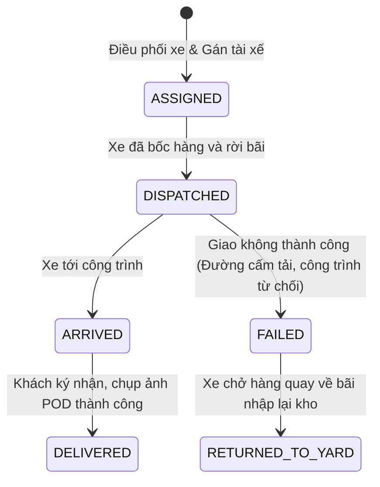
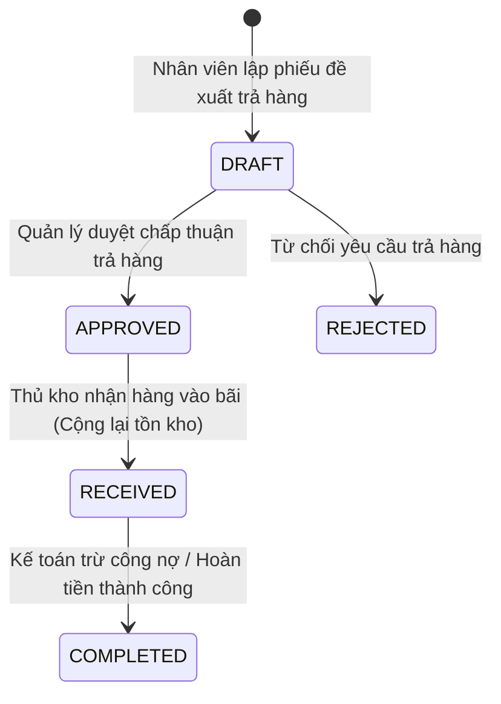

# Requirements — Giao hàng & Trả hàng (`delivery-return`)

> Tài liệu đặc tả yêu cầu nghiệp vụ chuẩn cho Module Điều phối Vận tải, Biên bản Bàn giao và Đổi trả vật liệu xây dựng.

---

## 1. Actors & Permissions

| Chức danh / Title | Quyền hạn trên module Giao & Trả hàng | Khả năng thực hiện (Capabilities) |
| --- | --- | --- |
| **Chủ cửa hàng / Quản lý chi nhánh** | Toàn quyền điều phối xe, duyệt phiếu hoàn trả hàng, xử lý bồi thường đổ vỡ/hao hụt. | `delivery:manage`, `delivery:read`, `return:approve`, `return:read` |
| **Thủ kho (User)** | Xuất hàng lên xe tải, ký phiếu xuất bãi, nhận hàng trả về nhập lại kho. | `delivery:dispatch`, `return:receive_stock` |
| **Tài xế / Nhân viên giao hàng (User)** | Xem danh sách chuyến xe cần chạy, cập nhật trạng thái đã tới công trình, xác nhận khách ký nhận/chụp ảnh biên bản giao hàng. | `delivery:update_status`, `delivery:upload_proof` |
| **Nhân viên bán hàng (User)** | Lập yêu cầu đổi trả hàng cho khách, theo dõi trạng thái giao hàng của các đơn mình phụ trách. | `delivery:read`, `return:create` |

---

## 2. Business Scope & Rules

- **Đặc thù giao hàng ngành VLXD:**
  - Hàng cồng kềnh, nặng (cát, đá, gạch, xi măng, sắt thép) $\rightarrow$ Một đơn hàng lớn thường được chia thành **nhiều chuyến xe** (vd $50 \text{ m}^3$ cát chia làm 10 chuyến xe ben $5 \text{ m}^3$).
  - Giao hàng tới địa chỉ công trình cụ thể, yêu cầu có người đại diện công trình (chỉ huy trưởng, cai thợ, chủ nhà) ký xác nhận vào Phiếu giao hàng.
- **Biên bản giao hàng (Proof of Delivery — POD):**
  - Ghi nhận thông tin xe (Biển số xe, Tên tài xế).
  - Khối lượng vật tư thực giao trên chuyến xe.
  - Hình ảnh chụp phiếu giao hàng có chữ ký hoặc hiện trường đổ hàng tại công trình.
- **Quy trình Đổi trả hàng (Sales Return & Reverse Accounting — DEC-006):**
  - Khách hàng thừa vật tư sau khi đổ bê tông/xây tường, hoặc hàng bị lỗi quy cách (gạch nứt vỡ, sắt bị gỉ sét quá mức).
  - Lập Phiếu trả hàng (`sales_return`):
    - Thủ kho kiểm tra tình trạng hàng trả về $\rightarrow$ Nhập kho hoàn tồn (`STOCK_RETURN_IMPORT`).
    - Kế toán tạo bút toán giảm công nợ phải thu của khách hàng (Credit Note) hoặc tạo phiếu chi hoàn tiền mặt nếu khách đã trả đủ 100%.

---

## 3. State Machine & Lifecycle

### Vòng đời Chuyến Giao Hàng (Delivery Trip)

### Vòng đời Phiếu Trả Hàng (Sales Return)

---

## 4. Invariants (Quy tắc bất biến)

1. **Delivered Quantity Limit:** Tổng số lượng giao của tất cả các chuyến xe không được vượt quá số lượng khách đã đặt trên đơn hàng (trừ khi có phụ lục phát sinh).
2. **Return Quantity Limit:** Số lượng trả hàng không bao giờ được vượt quá số lượng khách đã thực nhận trên đơn hàng gốc.
3. **Proof Required for Completion:** Chuyến giao hàng bắt buộc phải có chữ ký xác nhận hoặc hình ảnh hiện trường trước khi chuyển trạng thái sang `DELIVERED`.
4. **No Stock Discrepancy on Return:** Hàng trả về bãi bắt buộc phải ghi nhận chính xác vào Sổ cái kho `inventory_ledger`.

---

## 5. Happy Path

1. Đơn hàng DH-001 cần giao $15 \text{ m}^3$ cát vàng.
2. Quản lý tạo Chuyến giao xe 1: Gán Xe ben `51C-12345` (Tài xế Nam), khối lượng $5 \text{ m}^3$.
3. Thủ kho bốc cát lên xe $\rightarrow$ Bấm "Xuất bãi" $\rightarrow$ Chuyến xe chuyển sang `DISPATCHED`.
4. Tài xế chở cát tới công trình Masteri $\rightarrow$ Đổ cát tại vị trí yêu cầu $\rightarrow$ Cai thầu ký vào phiếu giao hàng $\rightarrow$ Tài xế chụp ảnh biên bản bằng app $\rightarrow$ Bấm "Xác nhận đã giao" $\rightarrow$ Chuyển sang `DELIVERED`.
5. Hệ thống ghi nhận đã giao $5/15 \text{ m}^3$ của đơn hàng DH-001.

---

## 6. Failure & Edge Cases

| Trường hợp | Phản hồi hệ thống | Mã lỗi backend |
| --- | --- | --- |
| Trả hàng nhiều hơn số lượng đã mua | Chặn tạo phiếu trả hàng, thông báo vượt khối lượng đã giao | `RETURN_QUANTITY_EXCEEDS_DELIVERED` |
| Xe giao hàng bị công trình từ chối nhận | Chuyển chuyến sang `FAILED`, lập phiếu nhập hàng hồi bãi | `DELIVERY_REJECTED_BY_CUSTOMER` |
| Tạo chuyến giao hàng vượt số lượng còn lại của đơn | Báo lỗi vượt khối lượng còn lại cần giao | `DISPATCH_QUANTITY_EXCEEDED` |

---

## 7. Concurrency & Transaction Safety

- Cập nhật số lượng lũy kế đã giao của đơn hàng (`delivered_quantity`) được thực hiện bằng transaction atomic để đảm bảo nhiều chuyến xe giao đồng thời không làm lệch số liệu tổng của đơn hàng.

---

## 8. Audit & Observability

- Ghi nhận Audit Log cho: `DELIVERY_DISPATCHED`, `DELIVERY_COMPLETED`, `RETURN_REQUESTED`, `RETURN_APPROVED`, `RETURN_STOCK_RECEIVED`.
- Lưu trữ bằng chứng hình ảnh giao hàng (POD image URL) trên storage an toàn.

---

## 9. Service Plan Gates

- Tính năng Giao hàng và Trả hàng cơ bản áp dụng cho toàn bộ các gói dịch vụ.
- Tính năng Theo dõi lộ trình xe thời gian thực (Live GPS Tracking) và Quản lý đội xe riêng (Fleet Management) áp dụng cho gói Enterprise.

---

## 10. Acceptance Criteria

- [ ] Cho phép chia 1 đơn hàng lớn thành nhiều chuyến giao hàng nhỏ lẻ.
- [ ] Ghi nhận bằng chứng bàn giao (chữ ký / hình ảnh chụp biên bản) khi hoàn tất giao hàng.
- [ ] Quy trình Đổi trả hàng tính toán chính xác việc hoàn tồn vào Sổ cái và giảm trừ công nợ khách hàng.
- [ ] Chặn triệt để việc trả hàng vượt quá số lượng đã mua.

---

## 11. Out of Scope

- Tự động tối ưu hóa lộ trình xe đa điểm thông minh (Vehicle Routing Problem AI) trong MVP.
- Tự động tích hợp camera phạt nguội hành trình xe.
