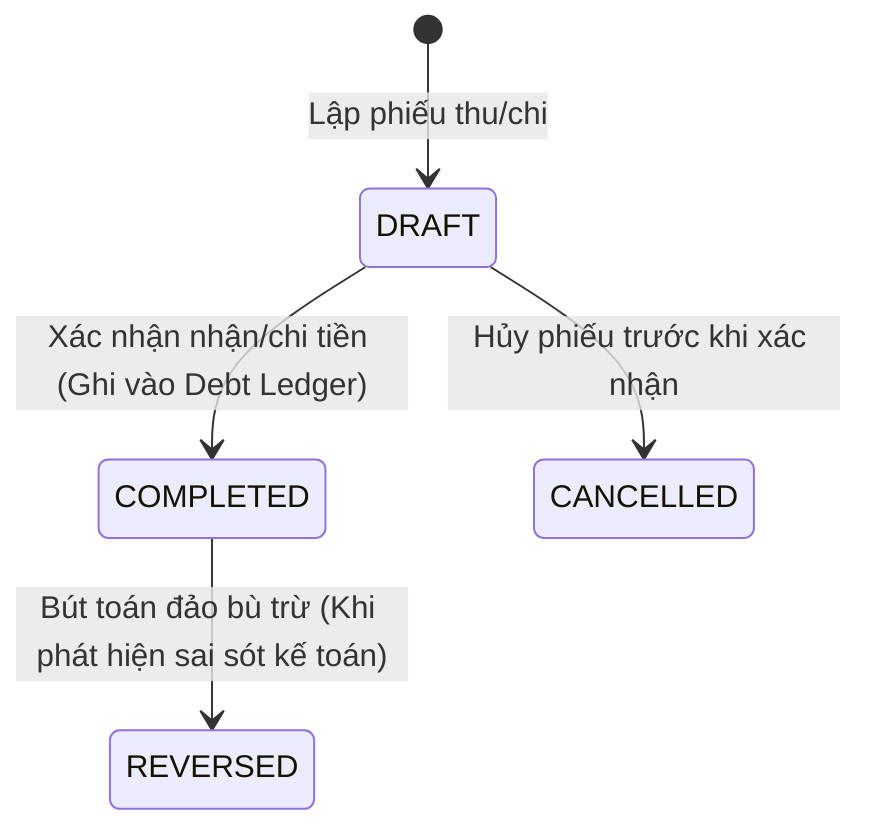

# Requirements — Quản lý Tài chính, Thu chi & Sổ nợ (`finance-debt`)

> Tài liệu đặc tả yêu cầu nghiệp vụ chuẩn cho Module Quản lý Thu chi, Thanh toán từng phần và Sổ nợ công nợ hai chiều.

---

## 1. Actors & Permissions

| Chức danh / Title | Quyền hạn trên module Tài chính | Khả năng thực hiện (Capabilities) |
| --- | --- | --- |
| **Chủ cửa hàng (Super Admin)** | Toàn quyền xem sổ cái tài chính, duyệt phiếu chi lớn, xóa/sửa bút toán nhầm lẫn có audit, xem dòng tiền. | `finance:manage`, `finance:read_ledger`, `finance:payment_approve_unlimited`, `finance:debt_adjust` |
| **Kế toán bán hàng / Công nợ (Support Admin)** | Lập phiếu thu tiền mặt/ngân hàng, lập phiếu chi thanh toán NCC, đối soát công nợ khách hàng, xuất báo cáo nợ. | `finance:receipt_create`, `finance:payment_create`, `finance:debt_read`, `finance:debt_reconcile` |
| **Thu ngân (User)** | Lập phiếu thu tiền đơn hàng tại quầy (tiền mặt / VietQR), in biên lai thu tiền. | `finance:receipt_create_pos` |
| **Nhân viên bán hàng (User)** | Xem số nợ hiện tại của khách hàng mình phụ trách để đốc thúc thu hồi công nợ. | `finance:debt_read_customer` |

---

## 2. Business Scope & Rules

- **Sổ cái Công nợ Kép (`debt_ledger` — DEC-007):**
  - Quản lý công nợ hai chiều: **Công nợ phải thu (Khách hàng)** và **Công nợ phải trả (Nhà cung cấp)**.
  - Mỗi biến động nợ được ghi nhận bằng một dòng bất biến (Append-only) gồm:
    - `DEBIT` (Ghi nợ): Tăng nợ phải thu của khách (khi xuất bán hàng) hoặc giảm nợ phải trả NCC (khi trả tiền NCC).
    - `CREDIT` (Ghi có): Giảm nợ phải thu của khách (khi thu tiền khách) hoặc tăng nợ phải trả NCC (khi nhập mua hàng).
  - Công thức tính số dư nợ:
    $$\text{Dư nợ phải thu khách hàng} = \sum \text{Debit} - \sum \text{Credit}$$
- **Thanh toán từng phần (Partial Payment):**
  - Một đơn hàng trị giá lớn (vd 100,000,000 đ) cho phép khách hàng đặt cọc trước (vd 30,000,000 đ), thanh toán đợt 2 khi giao hàng (vd 40,000,000 đ) và thanh toán nốt phần còn lại sau 30 ngày.
  - Mỗi lần thanh toán sinh một Phiếu thu (`payment_receipt`) được liên kết trực tiếp với mã đơn hàng (`order_id`) và mã khách hàng (`customer_id`).
- **Phương thức thanh toán:**
  - Tiền mặt (Cash).
  - Chuyển khoản ngân hàng qua mã động **VietQR** (tự động điền số tài khoản, số tiền và nội dung thanh toán theo cú pháp `VLXD <Mã Đơn>`).
  - Ghi nợ vào sổ công nợ (On Credit).
- **Hóa đơn Giá trị Gia tăng (VAT Invoice — DEC-008):**
  - Quản lý xuất hóa đơn VAT theo yêu cầu của khách hàng doanh nghiệp/nhà thầu.
  - Tách bạch rõ giữa Hóa đơn bán lẻ (nội bộ) và Hóa đơn tài chính VAT (phục vụ kê khai thuế).

---

## 3. State Machine & Lifecycle

### Vòng đời Phiếu Thu / Phiếu Chi (Payment Transaction)

---

## 4. Invariants (Quy tắc bất biến)

1. **Receipt Amount Positive:** Số tiền trên phiếu thu/phiếu chi phải $> 0$.
2. **Total Collected Limit:** Tổng tiền thu của một đơn hàng không được vượt quá tổng giá trị đơn hàng (trừ trường hợp khách thanh toán dư được ghi nhận vào tài khoản tiền gửi trả trước).
3. **Immutable Financial Ledger:** Dòng trong `debt_ledger` một khi đã ghi sổ không bao giờ được phép xóa hay chỉnh sửa trực tiếp. Mọi sai sót phải điều chỉnh bằng phiếu bù trừ đảo dấu (`REVERSED`).
4. **Currency Default:** Tiền tệ chuẩn hệ thống là Việt Nam Đồng (VND).

---

## 5. Happy Path

1. Khách hàng Công ty An Gia thanh toán đợt 2 cho đơn hàng DH-001 số tiền $40,000,000$ đ qua chuyển khoản.
2. Kế toán mở màn hình Đơn hàng DH-001 $\rightarrow$ Bấm "Lập phiếu thu".
3. Chọn Phương thức: `BANK_TRANSFER`, Tài khoản thụ hưởng: `Vietcombank - Cửa hàng VLXD`.
4. Nhập Số tiền: $40,000,000$ đ, Nội dung: `An Gia thanh toan dot 2 DH-001`.
5. Bấm "Xác nhận thu tiền":
   - Tạo phiếu thu PT-20260822-005.
   - Thêm dòng `CREDIT` $40,000,000$ đ vào `debt_ledger` của khách hàng An Gia.
   - Giảm số nợ còn lại của đơn hàng DH-001 từ $70,000,000$ đ xuống $30,000,000$ đ.
6. Hệ thống in phiếu thu / gửi biên nhận PDF cho khách hàng.

---

## 6. Failure & Edge Cases

| Trường hợp | Phản hồi hệ thống | Mã lỗi backend |
| --- | --- | --- |
| Thu vượt quá số nợ của đơn hàng | Cảnh báo thu thừa, gợi ý chuyển tiền thừa vào tài khoản trả trước của khách | `PAYMENT_EXCEEDS_ORDER_BALANCE` |
| Hủy phiếu thu đã ghi sổ kế toán | Chặn xóa trực tiếp, yêu cầu lập phiếu đảo bù trừ có ghi chú lý do | `CANNOT_HARD_DELETE_POSTED_PAYMENT` |
| Nhập số tiền thu $\le 0$ | Báo lỗi validation số tiền không hợp lệ | `INVALID_PAYMENT_AMOUNT` |

---

## 7. Concurrency & Transaction Safety

- Cập nhật số dư công nợ khách hàng và trạng thái thanh toán của đơn hàng được thực hiện trong 1 transaction an toàn với Row-Level Lock để tránh tình trạng ghi nhận trùng phiếu thu hoặc sai lệch số dư nợ khi nhiều giao dịch thu tiền diễn ra đồng thời.

---

## 8. Audit & Observability

- Ghi nhận Audit Log cho: `PAYMENT_RECEIVED`, `PAYMENT_PAID_TO_SUPPLIER`, `DEBT_ADJUSTED`, `PAYMENT_REVERSED`.
- Báo cáo đối soát công nợ tự động kiểm tra tính toàn vẹn: $\text{Số dư hiện tại} = \sum \text{Dòng phát sinh Sổ cái}$.

---

## 9. Service Plan Gates

- Module Tài chính & Quản lý công nợ cơ bản áp dụng cho toàn bộ các gói dịch vụ.
- Tính năng Tự động sinh mã VietQR động theo đơn hàng và Tích hợp thông báo Webhook biến động số dư ngân hàng áp dụng cho gói Premium & Enterprise.

---

## 10. Acceptance Criteria

- [ ] Sổ cái nợ `debt_ledger` phản ánh chính xác số dư nợ của từng khách hàng và nhà cung cấp.
- [ ] Hỗ trợ thanh toán nhiều lần trên 1 đơn hàng (Partial Payment).
- [ ] Tích hợp hiển thị mã VietQR động chuẩn Napas 247 khi thanh toán chuyển khoản.
- [ ] Quản lý đầy đủ hóa đơn VAT và phiếu thu chi nội bộ.

---

## 11. Out of Scope

- Tích hợp trực tiếp hệ thống Core Banking của các ngân hàng thương mại để tự động chi hộ (Auto-payout) trong MVP.
- Tự động lập bảng cân đối kế toán theo Thông tư 200/TT-BTC chuẩn doanh nghiệp lớn (hỗ trợ sổ sách quản trị nội bộ trong MVP).
