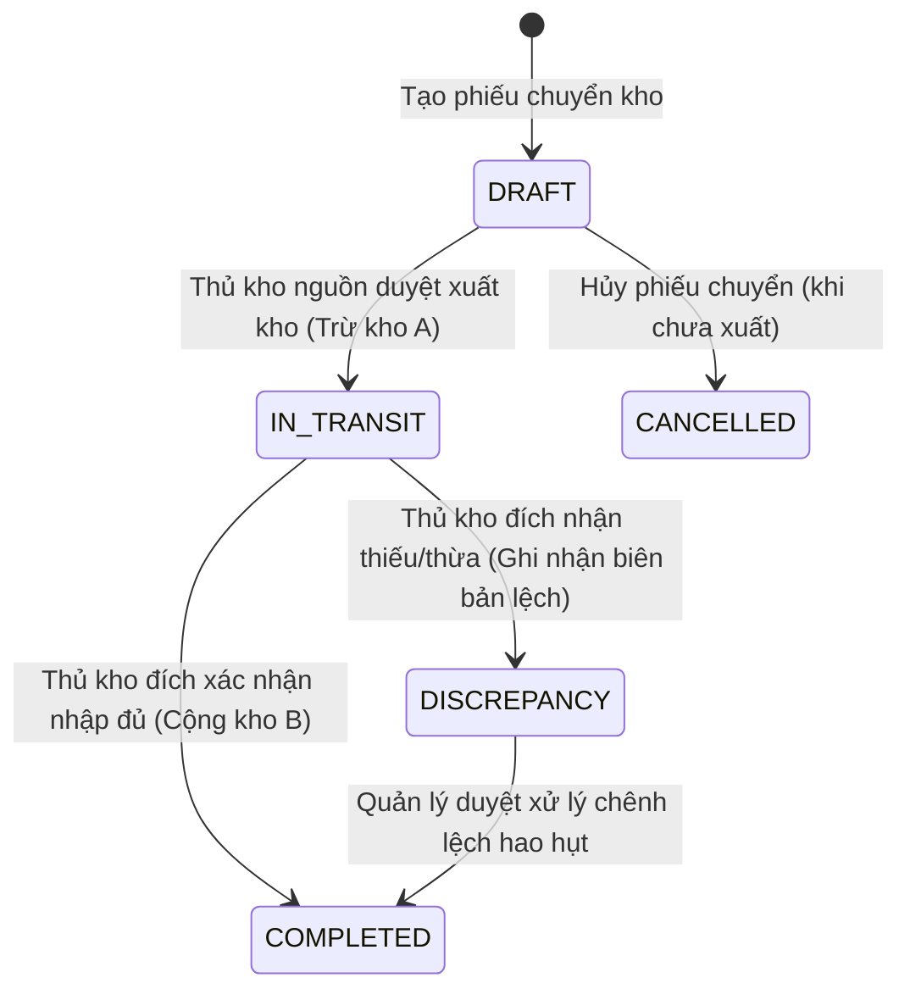

# Requirements — Quản lý Tồn kho & Sổ cái Kho (`inventory`)

> Tài liệu đặc tả yêu cầu nghiệp vụ chuẩn cho Module Tồn kho, Sổ cái kho và Điều chuyển vật tư.

---

## 1. Actors & Permissions

| Chức danh / Title                     | Quyền hạn trên module Tồn kho                                                                          | Khả năng thực hiện (Capabilities)                                                                      |
| ------------------------------------- | ------------------------------------------------------------------------------------------------------ | ------------------------------------------------------------------------------------------------------ |
| **Chủ cửa hàng (Super Admin)**        | Toàn quyền xem sổ cái, duyệt phiếu kiểm kê điều chỉnh chênh lệch lớn, cấu hình quy tắc xuất kho.       | `inventory:read_ledger`, `inventory:audit_adjust`, `inventory:transfer`, `inventory:configure`         |
| **Quản lý chi nhánh (Support Admin)** | Xem tồn kho các kho thuộc chi nhánh, lập và duyệt phiếu nhập/xuất kho, duyệt kiểm kê định kỳ.          | `inventory:read`, `inventory:import`, `inventory:export`, `inventory:stock_take`, `inventory:transfer` |
| **Thủ kho (User)**                    | Thực hiện phiếu nhập kho nhà cung cấp, xuất kho giao hàng, kiểm đếm tồn thực tế, nhận hàng chuyển kho. | `inventory:read`, `inventory:import_execute`, `inventory:export_execute`, `inventory:count`            |
| **Nhân viên bán hàng (User)**         | Tra cứu tồn kho khả dụng (`available = on_hand - reserved`) theo từng kho để tư vấn khách.             | `inventory:read_available`                                                                             |

---

## 2. Business Scope & Rules

- **Sổ cái kho bất biến (`inventory_ledger`):** Mọi biến động tăng giảm hoặc giữ chỗ tồn kho đều được ghi nhận bằng một dòng sự kiện bất biến (Append-only Ledger). Không bao giờ cập nhật trực tiếp hoặc ghi đè số tồn mà không có chứng từ gốc.
- **Phân định 3 chỉ số tồn kho (DEC-003):**
  - $\text{Tồn thực tế (On Hand)} = \text{Tổng nhập thực tế} - \text{Tổng xuất thực tế}$.
  - $\text{Tồn đang giữ chỗ (Reserved)} = \text{Tổng số lượng trên các Đơn hàng đã Xác nhận nhưng chưa xuất bãi}$.
  - $\text{Tồn khả dụng (Available)} = \text{On Hand} - \text{Reserved}$.
- **Chính sách Chặn Xuất Âm & Đơn đặt trước Backorder (DEC-004):**
  - Mặc định hệ thống áp dụng cơ chế **Strict No-Negative Stock**: Không cho phép tạo hoặc thực thi phiếu xuất kho nếu $\text{Số lượng xuất} > \text{Tồn thực tế}$.
  - Hỗ trợ Đơn đặt trước (`BACKORDER`): Khi hàng chưa về bãi, đơn hàng vẫn được tạo ở trạng thái Backorder; khi có phiếu nhập kho mới, hệ thống tự động ưu tiên phân bổ hàng cho các đơn Backorder theo thứ tự FIFO thời gian tạo đơn.
- **Tính giá vốn Bình quân gia quyền liên hoàn (DEC-009):**
  - Mỗi khi phát sinh giao dịch Nhập kho thành công, giá vốn bình quân của sản phẩm tại kho được tính lại tự động:
    $$\text{Giá vốn mới} = \frac{(\text{On Hand cũ} \times \text{Giá vốn cũ}) + (\text{Số lượng nhập} \times \text{Giá nhập})}{ \text{On Hand cũ} + \text{Số lượng nhập} }$$
  - Giá vốn này được ghi nhận vào dòng giao dịch xuất kho để phục vụ tính giá vốn hàng bán (COGS) và báo cáo lợi nhuận gộp.
- **Quy trình Chuyển kho 2 bước (DEC-012):**
  - _Bước 1 (Xuất chuyển):_ Kho A tạo phiếu xuất chuyển $\rightarrow$ Trừ tồn kho A $\rightarrow$ Hàng ghi nhận vào trạng thái Đang vận chuyển (`IN_TRANSIT`).
  - _Bước 2 (Nhập nhận):_ Xe hàng tới Kho B $\rightarrow$ Thủ kho B kiểm đếm số lượng thực tế $\rightarrow$ Nhập kho B $\rightarrow$ Kết thúc `IN_TRANSIT`. Nếu có hao hụt (vd cát đá rơi vãi), ghi nhận phiếu hao hụt điều chỉnh.
- **Kiểm kê & Điều chỉnh tồn (Stock Take):**
  - Hỗ trợ kiểm kê định kỳ theo danh mục hoặc theo kho/bãi.
  - So sánh tồn sổ sách vs tồn thực tế $\rightarrow$ Sinh phiếu điều chỉnh chênh lệch (`STOCK_ADJUSTMENT`) có ghi rõ nguyên nhân (Hao hụt tự nhiên, gãy vỡ, sai sót bốc xếp).

---

## 3. State Machine & Lifecycle

### Vòng đời Phiếu Chuyển Kho (Stock Transfer)

---

## 4. Invariants (Quy tắc bất biến)

1. **Non-Negative Stock:** $\text{On Hand} \ge 0$ cho mọi sản phẩm tại mọi kho trong mọi thời điểm.
2. **Ledger Balance:** Số tồn hiện tại của sản phẩm tại kho phải bằng đúng tổng đại số toàn bộ các dòng giao dịch trong `inventory_ledger` của kho đó.
3. **Immutable History:** Dòng sổ cái kho đã ghi nhận thành công không bao giờ được phép `UPDATE` hoặc `DELETE`. Sai sót bắt buộc phải sửa bằng giao dịch bù trừ (Reverse Ledger Entry).
4. **Moving Cost Formula:** Giá vốn bình quân không bao giờ âm ($\text{Cost} \ge 0$).

---

## 5. Happy Path

1. Xe tải chở $10 \text{ tấn}$ xi măng Holcim về kho Hóc Môn theo Đơn mua hàng PO-001.
2. Thủ kho mở ứng dụng $\rightarrow$ Chọn Đơn PO-001 $\rightarrow$ Bấm "Tạo phiếu nhập kho".
3. Kiểm tra số lượng thực nhận $10 \text{ tấn}$ ($200 \text{ bao}$), chọn vị trí bãi `ZONE-A / Slot 02` $\rightarrow$ Bấm "Xác nhận nhập kho".
4. Database thực thi trong 1 transaction an toàn:
   - Thêm dòng `IMPORT` vào `inventory_ledger`.
   - Tăng $\text{On Hand}$ thêm $200 \text{ bao}$.
   - Tính lại giá vốn bình quân gia quyền.
   - Cập nhật trạng thái Đơn mua hàng thành Đã nhập kho.
5. Số tồn mới hiển thị ngay lập tức trên giao diện bán hàng của tất cả nhân viên.

---

## 6. Failure & Edge Cases

| Trường hợp                                     | Phản hồi hệ thống                                           | Mã lỗi backend                    |
| ---------------------------------------------- | ----------------------------------------------------------- | --------------------------------- |
| Xuất kho số lượng lớn hơn tồn thực tế          | Chặn xuất kho, thông báo không đủ hàng tồn                  | `INSUFFICIENT_INVENTORY`          |
| Hủy phiếu nhập kho đã xuất bán hết             | Chặn hủy trực tiếp, yêu cầu xử lý bù trừ công nợ và kiểm kê | `CANNOT_CANCEL_CONSUMED_IMPORT`   |
| Chuyển kho giữa 2 kho thuộc 2 tenant khác nhau | Chặn tuyệt đối, trả lỗi không cùng tenant                   | `CROSS_TENANT_TRANSFER_FORBIDDEN` |
| Nhập kho với giá nhập âm                       | Báo lỗi validation dữ liệu giá nhập                         | `INVALID_UNIT_COST`               |

---

## 7. Concurrency & Transaction Safety

- Mọi thao tác xuất/nhập/giữ chỗ tồn kho phải sử dụng PostgreSQL Row-Level Lock (`SELECT ... FOR UPDATE` trên bảng số dư kho `inventory_balances`) để ngăn chặn tình trạng Race Condition khi 2 nhân viên cùng bán 1 bao xi măng cuối cùng tại cùng 1 mili-giây.

---

## 8. Audit & Observability

- Ghi nhận Audit Log toàn diện cho các thao tác: `STOCK_IMPORTED`, `STOCK_EXPORTED`, `STOCK_RESERVED`, `STOCK_TRANSFERRED`, `STOCK_ADJUSTED`.
- Báo cáo đối soát sổ cái có thể chạy bất kỳ lúc nào để phát hiện sai lệch giữa số dư tức thời và tổng dòng ledger.

---

## 9. Service Plan Gates

- Tính năng Sổ cái kho và Quản lý tồn kho cơ bản áp dụng cho toàn bộ các gói (Free, Standard, Premium, Enterprise).
- Tính năng Cảnh báo hao hụt tự động và Chuyển kho đa điểm không giới hạn áp dụng cho gói Premium và Enterprise.

---

## 10. Acceptance Criteria

- [ ] Sổ cái kho `inventory_ledger` ghi nhận đầy đủ, bất biến mọi giao dịch kho.
- [ ] Tính năng Reserve khi duyệt đơn và Release khi hủy/xuất đơn hoạt động chính xác 100%.
- [ ] Chặn triệt để hành vi xuất âm tồn kho ở mức database constraint và application logic.
- [ ] Giá vốn bình quân gia quyền liên hoàn tự động tính toán lại chính xác sau mỗi phiếu nhập.
- [ ] Quy trình Chuyển kho 2 bước theo dõi được trạng thái hàng đang đi đường `IN_TRANSIT`.

---

## 11. Out of Scope

- Tự động tích hợp cảm biến đo thể tích cát đá bằng máy bay không người lái (Drone LiDAR).
- Robot tự hành bốc dỡ hàng tự động trong kho.
