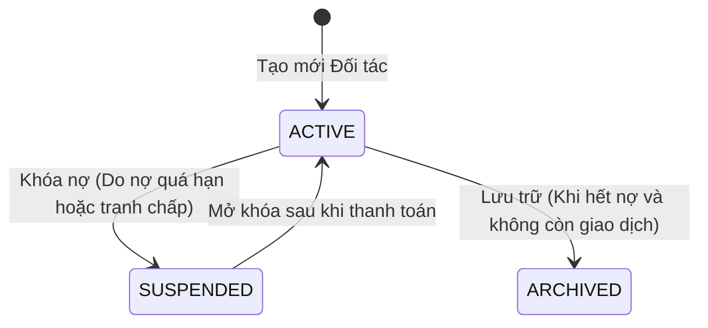

# Requirements — Quản lý Đối tác: Khách hàng & Nhà cung cấp (`partner`)

> Tài liệu đặc tả yêu cầu nghiệp vụ chuẩn cho Module Đối tác (Khách hàng, Nhà thầu, Nhà cung cấp vật tư).

---

## 1. Actors & Permissions

| Chức danh / Title | Quyền hạn trên module Đối tác | Khả năng thực hiện (Capabilities) |
| --- | --- | --- |
| **Chủ cửa hàng (Super Admin)** | Toàn quyền quản trị danh sách khách hàng & NCC, phê duyệt nâng hạn mức nợ (Credit Limit), xóa/gộp đối tác. | `partner:create`, `partner:read`, `partner:update`, `partner:delete`, `partner:credit_limit_manage` |
| **Kế toán công nợ (Support Admin)** | Xem lịch sử mua/bán, quản lý hạn mức nợ, theo dõi tuổi nợ, khóa nợ khách hàng quá hạn. | `partner:create`, `partner:read`, `partner:update`, `partner:credit_view` |
| **Nhân viên bán hàng (User)** | Thêm mới khách hàng, tra cứu thông tin liên hệ, xem số dư nợ hiện tại và hạn mức nợ khi lên đơn. | `partner:create`, `partner:read` |
| **Nhân viên mua hàng (User)** | Thêm mới nhà cung cấp, tra cứu bảng giá và thông tin tài khoản ngân hàng nhà cung cấp. | `partner:create`, `partner:read` |

---

## 2. Business Scope & Rules

- **Phân loại Khách hàng ngành VLXD:**
  - *Khách lẻ:* Mua vật tư sửa nhà, thanh toán tiền mặt/chuyển khoản ngay, `credit_limit = 0`.
  - *Nhà thầu cá nhân / Cai thầu:* Thường xuyên lấy hàng theo công trình, mua nợ gối đầu theo đợt nghiệm thu, có hạn mức nợ vừa (vd 50tr – 200tr).
  - *Công ty xây dựng / Doanh nghiệp:* Lấy hàng khối lượng lớn, có hợp đồng kinh tế, thanh toán định kỳ theo tháng, yêu cầu hóa đơn VAT, hạn mức nợ lớn (vd 500tr – vài tỷ).
- **Phân loại Nhà cung cấp:**
  - *Nhà máy sản xuất:* Nhà máy Xi măng (Hà Tiên, Holcim), Nhà máy Thép (Hòa Phát, Pomina), Nhà máy Gạch men.
  - *Đại lý cấp 1 / Nhà phân phối vùng:* Cung cấp sơn, phụ kiện điện nước, thiết bị vệ sinh.
  - *Chủ mỏ / Bến bãi cát đá:* Cung cấp cát sông, đá xây dựng theo chuyến sà lan/xe ben.
- **Hạn mức công nợ & Thời hạn nợ (DEC-011):**
  - Mỗi đối tác được thiết lập 2 thông số rủi ro:
    1. `credit_limit`: Số tiền nợ tối đa được phép ghi nợ (VND).
    2. `payment_term_days`: Số ngày được phép nợ kể từ ngày xuất hàng (vd 15 ngày, 30 ngày, 45 ngày).
  - *Cơ chế chặn vượt hạn mức (Strict Credit Check):* Khi $\text{Tổng nợ hiện tại} + \text{Giá trị đơn hàng mới} > \text{credit_limit}$, hệ thống **chặn hoàn tất đơn hàng** và yêu cầu quyền Quản lý/Chủ cửa hàng duyệt ngoại lệ (`partner:credit_override`).
- **Địa chỉ công trình (Delivery Addresses):** Một khách hàng có thể có nhiều địa chỉ giao hàng (công trình Nhà phố Quận 2, Biệt thự Thảo Điền, Nhà xưởng Bình Dương...). Khi tạo đơn, nhân viên chọn đúng công trình để giao hàng.

---

## 3. State Machine & Lifecycle

---

## 4. Invariants (Quy tắc bất biến)

1. **Partner Code / Phone Unique:** Số điện thoại hoặc Mã khách hàng (`code`) là duy nhất trong cùng một `tenant_id`.
2. **Non-Negative Credit Limit:** `credit_limit` phải $\ge 0$.
3. **No Delete with Debt:** Tuyệt đối không được xóa đối tác khi số dư nợ $\ne 0$ (vẫn còn nợ phải thu hoặc nợ phải trả).
4. **Partner Type Separation:** Đối tác có thể là `CUSTOMER`, `SUPPLIER` hoặc cả hai (`BOTH`), nhưng phải có ít nhất 1 vai trò hợp lệ.

---

## 5. Happy Path

1. Nhân viên bán hàng tiếp nhận khách hàng mới: `Công ty TNHH Xây dựng An Gia`.
2. Nhập Tên, Mã số thuế: `0312345678`, Số điện thoại: `0901234567`, Người đại diện: `Anh Tuấn (Chỉ huy trưởng)`.
3. Nhập Địa chỉ công trình 1: `Lô A5 Dự án Masteri, TP. Thủ Đức`.
4. Kế toán thiết lập Hạn mức nợ: `200,000,000 đ`, Thời hạn nợ: `30 ngày`.
5. Hệ thống lưu thành công; khách hàng sẵn sàng để lên đơn hàng xuất vật tư.

---

## 6. Failure & Edge Cases

| Trường hợp | Phản hồi hệ thống | Mã lỗi backend |
| --- | --- | --- |
| Tạo đơn vượt hạn mức nợ cho phép | Chặn tạo đơn, yêu cầu cấp trên duyệt ghi đè hoặc thu hồi bớt nợ cũ | `CREDIT_LIMIT_EXCEEDED` |
| Khách hàng đang bị khóa nợ (`SUSPENDED`) | Chặn tạo đơn mua nợ mới, chỉ cho phép thanh toán tiền mặt 100% | `PARTNER_ACCOUNT_SUSPENDED` |
| Trùng số điện thoại khách hàng trong tenant | Cảnh báo trùng lặp và gợi ý mở hồ sơ khách hàng đã có | `PARTNER_PHONE_ALREADY_EXISTS` |
| Xóa đối tác còn dư nợ | Chặn xóa, hiển thị chi tiết số nợ chưa thanh toán | `PARTNER_HAS_OUTSTANDING_DEBT` |

---

## 7. Concurrency & Transaction Safety

- Kiểm tra tổng nợ và hạn mức nợ được thực hiện trong cùng transaction tạo đơn hàng (`SELECT ... FOR UPDATE` trên bảng số dư công nợ của đối tác) để ngăn ngừa tình trạng nhiều nhân viên cùng lên đơn cho 1 khách hàng làm vượt hạn mức nợ đồng thời.

---

## 8. Audit & Observability

- Ghi nhận Audit Log cho mọi thay đổi: `PARTNER_CREATED`, `PARTNER_UPDATED`, `CREDIT_LIMIT_CHANGED`, `CREDIT_OVERRIDE_APPROVED`, `PARTNER_SUSPENDED`.
- Bắt buộc ghi lại `approved_by` khi có thao tác duyệt vượt hạn mức nợ.

---

## 9. Service Plan Gates

- Toàn bộ các gói (Free, Standard, Premium, Enterprise) đều có đầy đủ tính năng quản lý khách hàng và nhà cung cấp.
- Tính năng Tự động gửi tin nhắn SMS/Zalo nhắc nợ khách hàng khi đến hạn áp dụng cho gói Premium và Enterprise.

---

## 10. Acceptance Criteria

- [ ] Tạo và quản lý hồ sơ Khách hàng & Nhà cung cấp đầy đủ thông tin thuế, công trình, người đại diện.
- [ ] Kiểm soát hạn mức công nợ (Credit Limit) và thời hạn nợ chặt chẽ khi tạo đơn bán hàng.
- [ ] Tính năng duyệt ngoại lệ hạn mức nợ (`credit_override`) yêu cầu đúng quyền hạn và ghi nhận audit trail.
- [ ] Hỗ trợ 1 khách hàng có nhiều địa chỉ công trình giao hàng khác nhau.

---

## 11. Out of Scope

- Chấm điểm tín dụng tự động (Credit Scoring) qua hệ thống ngân hàng nhà nước CIC trong MVP.
- Tự động tích hợp tra cứu hóa đơn điện tử Tổng cục Thuế qua captcha tự động.
