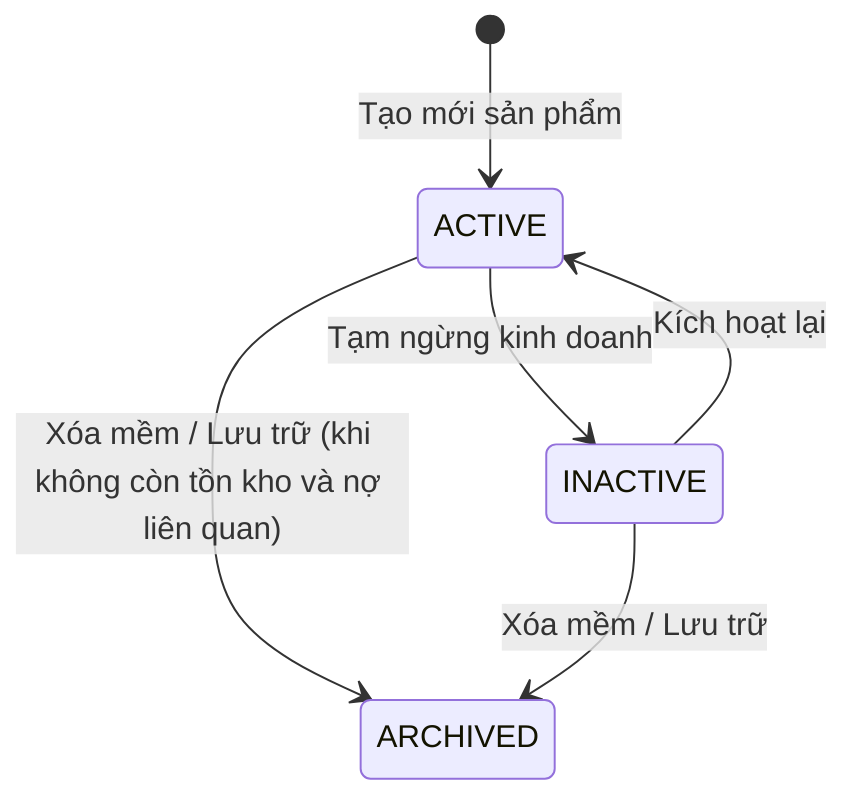

# Requirements — Quản lý Sản phẩm & Vật liệu (`product`)

> Tài liệu đặc tả yêu cầu nghiệp vụ chuẩn cho Module Sản phẩm & Vật liệu xây dựng.

---

## 1. Actors & Permissions

| Chức danh / Title                     | Quyền hạn trên module Sản phẩm                                                                     | Khả năng thực hiện (Capabilities)                                                                                    |
| ------------------------------------- | -------------------------------------------------------------------------------------------------- | -------------------------------------------------------------------------------------------------------------------- |
| **Chủ cửa hàng (Super Admin)**        | Toàn quyền cấu hình sản phẩm, giá vốn, giá bán, duyệt điều chỉnh giá hàng loạt.                    | `product:create`, `product:read`, `product:update`, `product:delete`, `product:price_update`, `product:unit_convert` |
| **Quản lý chi nhánh (Support Admin)** | Thêm mới, chỉnh sửa thông tin mô tả, xem giá vốn/giá bán, cấu hình định mức tồn kho tối thiểu.     | `product:create`, `product:read`, `product:update`, `product:unit_convert`                                           |
| **Nhân viên bán hàng (User)**         | Xem danh sách sản phẩm, giá bán theo nhóm khách, quy đổi đơn vị tính, tồn kho khả dụng để báo giá. | `product:read` (Ẩn giá vốn trừ khi được cấp quyền), `product:unit_convert`                                           |
| **Thủ kho (User)**                    | Xem thông tin sản phẩm, đơn vị tính, quy cách bốc xếp, vị trí bãi/kho.                             | `product:read`                                                                                                       |

---

## 2. Business Scope & Rules

- **Danh mục vật liệu ngành VLXD:** Phân nhóm theo ngành hàng: Cát đá (vật liệu thô xả đống), Xi măng & Vôi vữa, Gạch xây & Gạch ốp lát, Sắt thép xây dựng, Sơn & Chống thấm, Thiết bị điện nước, Gỗ cốp pha & Phụ kiện.
- **Mã sản phẩm (SKU):** Tự động sinh theo tiền tố danh mục (vd: `CAT-001`, `THEP-PHI10-01`) hoặc do người dùng nhập. SKU là duy nhất trên toàn bộ tenant (`tenant_id + sku`).
- **Đơn vị tính cơ sở & Đơn vị quy đổi:**
  - Mỗi sản phẩm có 1 đơn vị tính cơ sở dùng để ghi nhận tồn kho (vd: Cát: $m^3$; Gạch: viên; Thép: cây hoặc kg; Xi măng: bao 50kg).
  - Hỗ trợ công thức quy đổi tương đương:
    - Cát/Đá: $1 \text{ m}^3 \leftrightarrow \text{tỷ trọng } \times 1000 \text{ kg}$ (tỷ trọng mặc định 1.4 – 1.6 $tấn/m^3$).
    - Gạch: $1 \text{ m}^2 \leftrightarrow N \text{ viên}$ (tùy theo loại gạch ống 4 lỗ, 6 lỗ, gạch block).
    - Thép cây: $1 \text{ cây } (11.7m) \leftrightarrow M \text{ kg}$ (theo barem tiêu chuẩn Việt Nam TCVN).
- **Quản lý giá đa tầng:**
  - _Giá vốn:_ Tự động cập nhật theo phương pháp Bình quân gia quyền liên hoàn (DEC-009).
  - _Giá bán lẻ:_ Giá niêm yết chuẩn cho khách mua nhỏ lẻ.
  - _Giá bán thầu / sỉ:_ Giá ưu đãi cho thầu thợ, công ty xây dựng.
- **Lịch sử biến động giá:** Mỗi lần thay đổi giá bán hoặc giá nhập phải ghi nhận thời điểm, giá cũ, giá mới, người thực hiện và lý do.

---

## 3. State Machine & Lifecycle

---

## 4. Invariants (Quy tắc bất biến)

1. **SKU Unique:** Không bao giờ tồn tại hai sản phẩm trùng SKU trong cùng một `tenant_id`.
2. **Positive Pricing:** Giá bán lẻ và giá bán thầu phải $\ge 0$.
3. **Valid Base Unit:** Một sản phẩm bắt buộc phải có đúng một đơn vị tính cơ sở (`base_unit`).
4. **No Delete with History:** Không thể xóa vật lý (hard-delete) sản phẩm đã từng phát sinh giao dịch trong Sổ cái kho hoặc Đơn hàng. Chỉ được chuyển sang trạng thái `ARCHIVED`.

---

## 5. Happy Path

1. Quản lý vào màn hình Sản phẩm $\rightarrow$ Bấm "Thêm sản phẩm mới".
2. Nhập Tên: `Thép Cuộn Phi 8 Hòa Phát`, Danh mục: `SAT_THEP`, Đơn vị cơ sở: `kg`.
3. Nhập tỷ trọng quy đổi: $1 \text{ cuộn} = 1000 \text{ kg}$, Định mức cảnh báo tồn tối thiểu: $500 \text{ kg}$.
4. Nhập Giá bán lẻ: `18,500 đ/kg`, Giá bán thầu: `17,800 đ/kg`.
5. Hệ thống validate schema Zod $\rightarrow$ Kiểm tra giới hạn số lượng sản phẩm theo gói dịch vụ (DEC-001/Gói) $\rightarrow$ Lưu vào database.
6. Sản phẩm xuất hiện ngay trong danh mục sẵn sàng cho báo giá và bán hàng.

---

## 6. Failure & Edge Cases

| Trường hợp                             | Phản hồi hệ thống                                        | Mã lỗi backend                 |
| -------------------------------------- | -------------------------------------------------------- | ------------------------------ |
| Trùng mã SKU trong tenant              | Chặn lưu, thông báo mã SKU đã tồn tại                    | `PRODUCT_SKU_ALREADY_EXISTS`   |
| Vượt giới hạn sản phẩm của gói dịch vụ | Chặn tạo mới, yêu cầu nâng cấp gói                       | `PRODUCT_LIMIT_REACHED`        |
| Tỷ lệ quy đổi $\le 0$                  | Báo lỗi validation công thức quy đổi                     | `INVALID_UNIT_CONVERSION_RATE` |
| Xóa sản phẩm đang có tồn kho $> 0$     | Chặn xóa, yêu cầu xuất hết tồn kho hoặc điều chỉnh trước | `PRODUCT_HAS_ACTIVE_INVENTORY` |

---

## 7. Concurrency & Transaction Safety

- Kiểm tra tính duy nhất của SKU sử dụng unique constraint ở mức database: `UNIQUE(tenant_id, sku) WHERE deleted_at IS NULL`.
- Cập nhật giá sản phẩm sử dụng optimistic locking hoặc transaction có audit trail.

---

## 8. Audit & Observability

- Ghi nhận Audit Log cho mọi hành động: `PRODUCT_CREATED`, `PRODUCT_UPDATED`, `PRODUCT_PRICE_CHANGED`, `PRODUCT_ARCHIVED`.
- Log chứa thông tin: `actor_id`, `product_id`, `before_state`, `after_state`, `timestamp`, `ip_address`.

---

## 9. Service Plan Gates

- **Free Plan:** Tối đa **80 sản phẩm**. Khi đạt 80 sản phẩm, nút "Thêm mới" bị vô hiệu hóa; backend chặn API tạo mới (`PRODUCT_LIMIT_REACHED`).
- **Standard Plan:** Tối đa **800 sản phẩm**.
- **Premium & Enterprise Plan:** Không giới hạn số lượng sản phẩm.

---

## 10. Acceptance Criteria

- [ ] Tạo được sản phẩm đầy đủ thuộc tính đặc thù VLXD (tỷ trọng, đơn vị quy đổi, barem thép).
- [ ] Tính năng quy đổi đơn vị tính toán chính xác giữa $m^3 \leftrightarrow tấn$, $m^2 \leftrightarrow viên$, $cây \leftrightarrow kg$.
- [ ] Lịch sử giá lưu đầy đủ biến động giá vốn và giá bán theo thời gian.
- [ ] Giới hạn gói 80 SP (Free) và 800 SP (Standard) được enforce chặt chẽ ở backend.
- [ ] Ẩn giá vốn đối với nhân viên bán hàng không có quyền `product:read_cost`.

---

## 11. Out of Scope

- Quản lý số serial từng sản phẩm riêng lẻ (VLXD không dùng serial mà dùng lô/bãi).
- Tích hợp cân điện tử tự động qua Bluetooth/RS232 ở giai đoạn MVP (nhập tay khối lượng cân).
