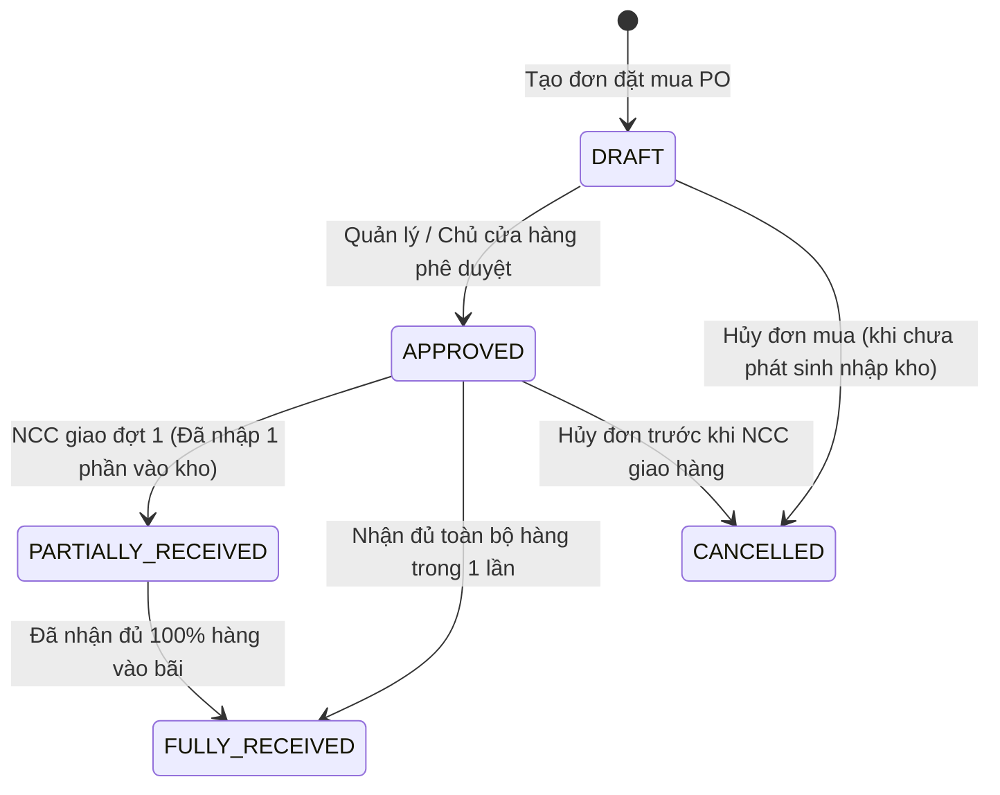

# Requirements — Quản lý Mua hàng & Nhập NCC (`purchase`)

> Tài liệu đặc tả yêu cầu nghiệp vụ chuẩn cho Module Đơn đặt hàng Mua (PO) và Nhập hàng từ Nhà cung cấp.

---

## 1. Actors & Permissions

| Chức danh / Title                     | Quyền hạn trên module Mua hàng                                                              | Khả năng thực hiện (Capabilities)                                                   |
| ------------------------------------- | ------------------------------------------------------------------------------------------- | ----------------------------------------------------------------------------------- |
| **Chủ cửa hàng (Super Admin)**        | Duyệt đơn mua hàng giá trị lớn, đàm phán hợp đồng cung ứng, xem tổng chi phí mua hàng.      | `purchase:create`, `purchase:read`, `purchase:approve_unlimited`, `purchase:cancel` |
| **Quản lý chi nhánh (Support Admin)** | Lập và duyệt đơn mua hàng bổ sung tồn kho cho chi nhánh, theo dõi tiến độ giao hàng từ NCC. | `purchase:create`, `purchase:read`, `purchase:approve`, `purchase:receive`          |
| **Nhân viên mua hàng (User)**         | Tạo đơn đề xuất mua hàng (PO), theo dõi giá nhập từ các nhà cung cấp, liên hệ đặt hàng.     | `purchase:create`, `purchase:read`                                                  |
| **Thủ kho (User)**                    | Kiểm đếm và thực hiện thủ tục nhập kho khi xe hàng của NCC chở tới bãi.                     | `purchase:read`, `purchase:receive_stock`                                           |

---

## 2. Business Scope & Rules

- **Đặc thù mua hàng ngành VLXD:**
  - Nhập hàng khối lượng lớn (theo xe tải, xe ben, sà lan hoặc container).
  - Giá nhập biến động thường xuyên theo thị trường (thép, cát, đá thay đổi theo tuần/ngày).
  - Nhập hàng theo từng đợt: Một đơn đặt mua $100 \text{ tấn}$ thép có thể được nhà máy giao làm 3 đợt.
- **Quy trình Đơn mua hàng (Purchase Order — PO):**
  - Tạo đơn PO $\rightarrow$ Duyệt đơn PO $\rightarrow$ Nhà cung cấp giao hàng tới bãi $\rightarrow$ Thủ kho lập phiếu nhập kho (`inventory_import`) $\rightarrow$ Kế toán ghi nhận công nợ phải trả NCC.
- **Tự động cập nhật Giá vốn (DEC-009):**
  - Khi hoàn tất phiếu nhập kho từ PO, hệ thống tự động cập nhật lại giá vốn bình quân gia quyền của sản phẩm.
- **Công nợ phải trả Nhà cung cấp:**
  - Mỗi đơn mua hàng làm tăng nợ phải trả NCC (`debt_ledger DEBIT NCC / CREDIT Phải trả`).
  - Khi thanh toán tiền cho NCC qua chuyển khoản/tiền mặt, kế toán tạo Phiếu chi (`payment_voucher`) để giảm trừ công nợ.

---

## 3. State Machine & Lifecycle

---

## 4. Invariants (Quy tắc bất biến)

1. **PO Number Unique:** Mã đơn mua hàng (`po_number`, vd: `PO-20260822-0001`) là duy nhất trong cùng một `tenant_id`.
2. **Total Received Limit:** Tổng số lượng hàng nhập kho lũy kế từ một đơn PO không được vượt quá số lượng đặt mua trên PO (trừ khi có điều chỉnh khối lượng được duyệt).
3. **Valid Purchase Price:** Giá nhập mua hàng phải $> 0$.
4. **Auto-Stock Update:** Phiếu nhập kho từ PO bắt buộc phải đồng bộ tự động vào Sổ cái tồn kho `inventory_ledger`.

---

## 5. Happy Path

1. Nhân viên mua hàng thấy cát vàng tại bãi Hóc Môn sắp hết (dưới định mức tối thiểu $50 \text{ m}^3$).
2. Tạo đơn PO-002: Đặt mua $100 \text{ m}^3$ cát vàng từ `Chủ mỏ Cát Tân Châu`, Đơn giá: $220,000$ đ/$m^3$.
3. Quản lý duyệt đơn PO-002.
4. Sà lan chở cát cập bến $\rightarrow$ Xe ben chở cát đổ về bãi Hóc Môn đợt 1 ($40 \text{ m}^3$).
5. Thủ kho tạo Phiếu nhập kho theo PO-002: Số lượng $40 \text{ m}^3$ $\rightarrow$ Tồn kho tăng thêm $40 \text{ m}^3$, tính lại giá vốn bình quân $\rightarrow$ Đơn PO chuyển sang `PARTIALLY_RECEIVED`.
6. Kế toán ghi nhận tăng nợ phải trả NCC Tân Châu số tiền $8,800,000$ đ.

---

## 6. Failure & Edge Cases

| Trường hợp                                        | Phản hồi hệ thống                                    | Mã lỗi backend                 |
| ------------------------------------------------- | ---------------------------------------------------- | ------------------------------ |
| Nhập kho số lượng lớn hơn số lượng còn lại của PO | Chặn nhập vượt, yêu cầu tạo đơn bổ sung hoặc sửa PO  | `PO_RECEIVE_QUANTITY_EXCEEDED` |
| Hủy đơn PO đã phát sinh phiếu nhập kho            | Chặn hủy trực tiếp, yêu cầu xử lý phiếu xuất trả NCC | `CANNOT_CANCEL_RECEIVED_PO`    |
| Nhập giá mua bằng $0$                             | Báo lỗi validation giá mua hàng không hợp lệ         | `INVALID_PURCHASE_PRICE`       |

---

## 7. Concurrency & Transaction Safety

- Cập nhật số lượng đã nhận (`received_quantity`) của đơn PO và tạo dòng nhập kho được thực thi trong cùng một database transaction để đảm bảo tính nhất quán tuyệt đối giữa Đơn mua và Sổ cái kho.

---

## 8. Audit & Observability

- Ghi nhận Audit Log cho: `PO_CREATED`, `PO_APPROVED`, `PO_STOCK_RECEIVED`, `PO_CANCELLED`.
- Theo dõi lịch sử biến động giá nhập từ các nhà cung cấp khác nhau để so sánh giá tối ưu.

---

## 9. Service Plan Gates

- Tính năng Quản lý Mua hàng & Nhập kho NCC có mặt trên toàn bộ các gói dịch vụ.
- Tính năng AI gợi ý tự động dự báo lượng hàng cần nhập dựa trên tốc độ bán hàng (AI Reordering) áp dụng cho gói Enterprise.

---

## 10. Acceptance Criteria

- [ ] Lập và theo dõi toàn bộ vòng đời đơn đặt mua hàng (PO) từ nhà máy/mỏ vật liệu.
- [ ] Hỗ trợ nhập hàng nhiều đợt trên cùng 1 đơn PO.
- [ ] Tự động đồng bộ số lượng nhập vào Sổ cái kho và tính toán lại giá vốn bình quân.
- [ ] Ghi nhận chính xác công nợ phải trả cho từng nhà cung cấp.

---

## 11. Out of Scope

- Tích hợp hệ thống đấu thầu mua hàng trực tuyến (E-Procurement B2B Auction) trong MVP.
- Tự động quét hóa đơn điện tử đầu vào XML của Tổng cục Thuế để sinh PO tự động.
