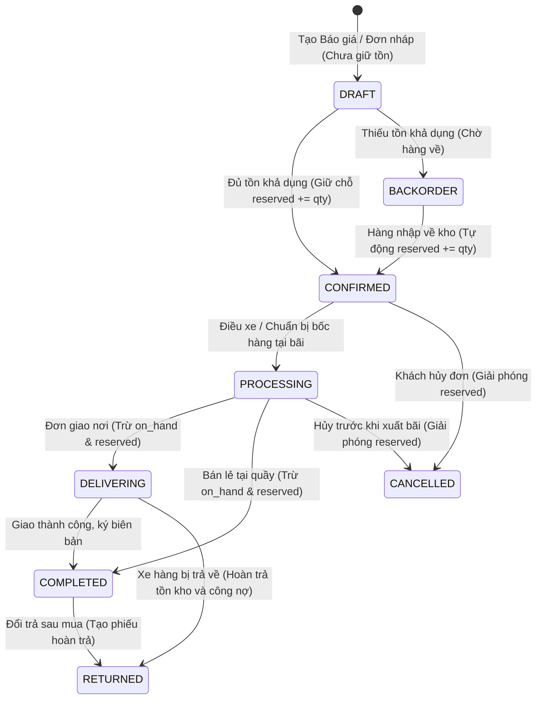

# Requirements — Quản lý Bán hàng & Đơn hàng (`sales-order`)

> Tài liệu đặc tả yêu cầu nghiệp vụ chuẩn cho Module Bán lẻ (POS) và Đơn hàng thương mại (Sales Order).

---

## 1. Actors & Permissions

| Chức danh / Title                     | Quyền hạn trên module Bán hàng                                                                                              | Khả năng thực hiện (Capabilities)                                                                                                                                      |
| ------------------------------------- | --------------------------------------------------------------------------------------------------------------------------- | ---------------------------------------------------------------------------------------------------------------------------------------------------------------------- |
| **Chủ cửa hàng (Super Admin)**        | Toàn quyền tạo đơn, sửa đơn, duyệt chiết khấu đặc biệt $> 10\%$, duyệt hạn mức nợ, hủy đơn hàng đã chốt, xem lợi nhuận đơn. | `sales.order.create`, `sales.order.read`, `sales.order.update`, `sales.order.cancel`, `sales.discount.override`, `customer.credit.override`, `sales.order.view_margin` |
| **Quản lý chi nhánh (Support Admin)** | Duyệt đơn hàng, duyệt chiết khấu $\le 10\%$, duyệt ngoại lệ hạn mức nợ, xem báo cáo bán hàng chi nhánh.                     | `sales.order.create`, `sales.order.read`, `sales.order.confirm`, `sales.discount.tier2`, `customer.credit.override`, `sales.order.cancel`                              |
| **Nhân viên bán hàng (User)**         | Tạo báo giá, tạo đơn hàng, áp dụng chiết khấu $\le 3\%$, in phiếu đặt hàng, theo dõi tiến độ giao hàng.                     | `sales.order.create`, `sales.order.read`, `sales.discount.tier1`, `sales.quote.create`                                                                                 |
| **Thu ngân (User)**                   | Thu tiền đơn hàng (tiền mặt/chuyển khoản VietQR), in hóa đơn bán lẻ/phiếu thu tiền.                                         | `sales.order.read`, `sales.payment.collect`                                                                                                                            |

---

## 2. Business Scope & Rules

- **Hai hình thức bán hàng đặc thù VLXD:**
  1. _Bán lẻ tại quầy / POS (Bán nhanh):_ Khách lấy hàng ngay tại bãi/quầy, thanh toán 100% $\rightarrow$ Đi qua luồng chuẩn `CONFIRMED` (giữ chỗ `reserved += qty`) $\rightarrow$ `PROCESSING` $\rightarrow$ Hoàn tất `COMPLETED` (trừ tồn thực tế `on_hand -= qty, reserved -= qty` duy nhất tại thời điểm hoàn tất nhận hàng và thanh toán).
  2. _Đơn hàng giao công trình (Sales Order):_ Lên báo giá/đơn hàng khối lượng lớn $\rightarrow$ Xác nhận đơn `CONFIRMED` (hoặc `BACKORDER` nếu thiếu tồn) $\rightarrow$ `PROCESSING` $\rightarrow$ Điều xe giao tận nơi `DELIVERING` (trừ tồn thực tế `on_hand -= qty, reserved -= qty` duy nhất tại thời điểm xuất bãi) $\rightarrow$ Khách nhận hàng `COMPLETED` $\rightarrow$ Thu tiền nhiều đợt.
- **Vòng đời State Machine 8 trạng thái (DEC-004, DEC-005):**
  `DRAFT`, `CONFIRMED`, `BACKORDER`, `PROCESSING`, `DELIVERING`, `COMPLETED`, `CANCELLED`, `RETURNED`.
- **Cơ chế Giữ chỗ Tồn kho & Sự kiện Trừ kho Thực tế duy nhất (DEC-003, DEC-004, DEC-005):**
  - Khi đơn ở trạng thái `DRAFT`: Không giữ chỗ tồn kho (khách mới hỏi giá).
  - Khi đơn chuyển sang `CONFIRMED`: Hệ thống tự động tăng `reserved += qty` trong `inventory_balances` để đảm bảo có đủ hàng giao cho khách (`available = on_hand - reserved`).
  - Đơn ở trạng thái `BACKORDER`: Không giữ chỗ tồn kho thực tế, chờ nhập hàng để chuyển `BACKORDER -> CONFIRMED` (nơi tự động `reserved += qty`).
  - **Sự kiện Trừ kho thực tế duy nhất (`EXPORT`):**
    - Đối với đơn giao hàng tận nơi: Trừ kho thực tế (`on_hand -= qty, reserved -= qty`) duy nhất tại thời điểm chuyển sang `DELIVERING` (hàng được bốc lên xe và xuất bãi).
    - Đối với đơn bán lẻ tại quầy / POS: Trừ kho thực tế (`on_hand -= qty, reserved -= qty`) duy nhất tại thời điểm chuyển sang `COMPLETED` (sau khi quét mã/kiểm đếm tại quầy và khách hoàn tất thanh toán nhận hàng).
  - Nếu hủy đơn `CANCELLED` từ `CONFIRMED` hoặc `PROCESSING`: Hệ thống giải phóng `reserved -= qty` trở lại tồn khả dụng.
- **Phân cấp Phê duyệt Chiết khấu theo Capability (DEC-010):**
  - Capability `sales.discount.tier1` (mặc định gán nhân viên bán hàng): Chiết khấu tối đa **$\le 3\%$**.
  - Capability `sales.discount.tier2` (mặc định gán quản lý cửa hàng): Chiết khấu tối đa **$\le 10\%$**.
  - Capability `sales.discount.override` (mặc định gán chủ cửa hàng / super admin): Chiết khấu vượt quá $10\%$ (yêu cầu phê duyệt Approval OTP / Xác nhận trực tiếp).
- **Kiểm soát Hạn mức Công nợ Khách hàng (DEC-011):**
  - Khi tổng nợ hiện tại + giá trị đơn mới $>$ `credit_limit`, hệ thống chặn xác nhận đơn (`CONFIRMED`) và yêu cầu capability `customer.credit.override` duyệt ghi đè.
- **Xử lý Thuế VAT (DEC-008):**
  - Mỗi dòng sản phẩm trên đơn hàng có cấu hình thuế suất riêng ($0\%, 5\%, 8\%, 10\%$).
  - Đơn hàng tính toán rõ: $\text{Tổng tiền trước thuế} + \text{Tổng tiền thuế VAT} - \text{Chiết khấu} + \text{Phí vận chuyển/bốc xếp} = \text{Tổng thanh toán}$.

---

## 3. State Machine & Lifecycle

---

## 4. Invariants (Quy tắc bất biến)

1. **Order Code Unique:** Mã đơn hàng (`order_number`, vd: `DH-20260822-0001`) là duy nhất trong cùng một `tenant_id`.
2. **Valid State Transitions:** Trạng thái đơn hàng chỉ được phép chuyển dịch theo đúng đồ thị State Machine, không được nhảy cóc (vd từ `DRAFT` nhảy thẳng lên `DELIVERING`).
3. **Price & Quantity Positive:** Số lượng mua $> 0$, Đơn giá $\ge 0$.
4. **Discount Policy Enforced:** Chiết khấu không vượt quá thẩm quyền của người tạo đơn tại thời điểm xác nhận.

---

## 5. Happy Path

1. Nhân viên bán hàng tiếp nhận yêu cầu từ Công ty An Gia: Đặt $20 \text{ m}^3$ cát bê tông + $2 \text{ tấn}$ thép phi 10.
2. Chọn khách hàng `Công ty An Gia`, chọn công trình `Dự án Masteri`.
3. Thêm các dòng sản phẩm, chọn kho xuất `Kho Hóc Môn`.
4. Nhập chiết khấu $2\%$ (trong hạn mức nhân viên $3\%$), nhập cước xe ben $500,000$ đ.
5. Bấm "Xác nhận đơn hàng" $\rightarrow$ Đơn chuyển sang `CONFIRMED` $\rightarrow$ Tồn kho cát và thép được giữ chỗ ngay lập tức $\rightarrow$ In phiếu đặt hàng gửi khách.

---

## 6. Failure & Edge Cases

| Trường hợp                                     | Phản hồi hệ thống                                                  | Mã lỗi backend                 |
| ---------------------------------------------- | ------------------------------------------------------------------ | ------------------------------ |
| Không đủ tồn kho khả dụng khi Confirm          | Chặn xác nhận đơn, gợi ý chuyển sang Đơn đặt trước (Backorder)     | `INSUFFICIENT_AVAILABLE_STOCK` |
| Nhân viên nhập chiết khấu $5\%$ ($> 3\%$)      | Yêu cầu tài khoản Quản lý chi nhánh duyệt                          | `DISCOUNT_REQUIRES_APPROVAL`   |
| Đơn hàng vượt hạn mức nợ của khách             | Chặn xác nhận, yêu cầu duyệt ghi đè hạn mức nợ                     | `CREDIT_LIMIT_EXCEEDED`        |
| Hủy đơn hàng khi xe đã xuất bãi (`DELIVERING`) | Chặn hủy trực tiếp, yêu cầu xử lý qua quy trình Trả hàng/Nhập hoàn | `CANNOT_CANCEL_IN_DELIVERY`    |

---

## 7. Concurrency & Transaction Safety

- Khi chuyển trạng thái sang `CONFIRMED`, transaction phải kiểm tra và cập nhật `reserved_quantity` nguyên tử bằng Row-Level Locking để tránh oversell khi nhiều đơn hàng cùng xác nhận cùng lúc.

---

## 8. Audit & Observability

- Ghi nhận Audit Log cho: `ORDER_CREATED`, `ORDER_CONFIRMED`, `ORDER_DISCOUNT_APPROVED`, `ORDER_STATUS_CHANGED`, `ORDER_CANCELLED`.
- Log lưu vết đầy đủ ai đã duyệt chiết khấu hoặc duyệt vượt hạn mức nợ.

---

## 9. Service Plan Gates

- Tính năng Quản lý Bán hàng và Đơn hàng có mặt trên toàn bộ các gói dịch vụ.
- Gói Premium & Enterprise hỗ trợ AI Assistant tự động trích xuất đơn hàng từ tin nhắn Zalo/ảnh chụp hóa đơn viết tay (OCR).

---

## 10. Acceptance Criteria

- [ ] Hỗ trợ cả 2 luồng Bán lẻ nhanh tại quầy (POS) và Đơn hàng giao công trình (Sales Order).
- [ ] State Machine chuyển trạng thái mượt mà, chặn các bước chuyển vi phạm logic.
- [ ] Cơ chế giữ chỗ tồn kho (Reservation) hoạt động chính xác khi đơn `CONFIRMED`.
- [ ] Phân cấp hạn mức chiết khấu $3\% / 10\% / >10\%$ được enforce chặt chẽ.
- [ ] Hỗ trợ tính toán chi tiết thuế VAT và phí vận chuyển/bốc xếp trên đơn hàng.

---

## 11. Out of Scope

- Bán hàng đa kênh đồng bộ sàn thương mại điện tử Shopee/Lazada trong MVP.
- Tự động đấu nối cổng thanh toán thẻ quốc tế Visa/Mastercard trực tiếp trên POS (sử dụng VietQR và tiền mặt trong MVP).
