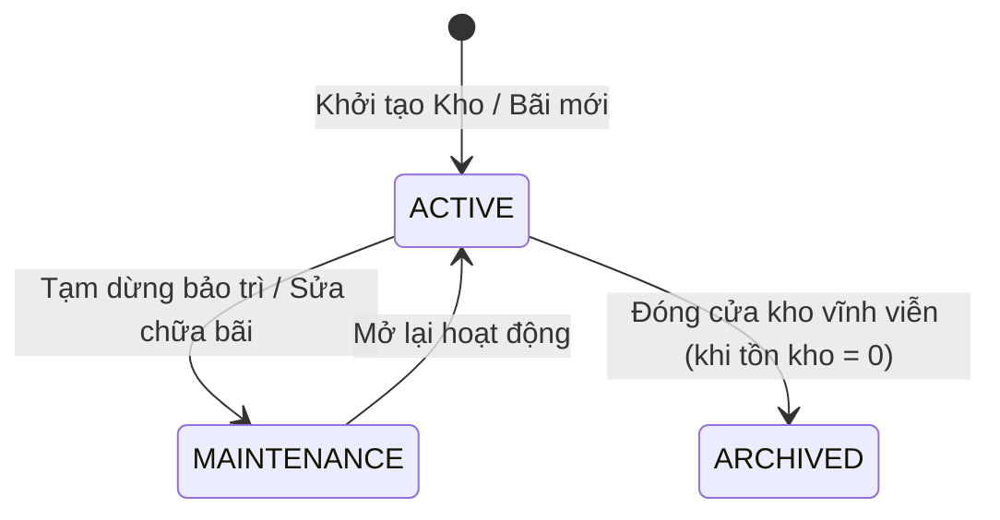

# Requirements — Quản lý Nhà kho & Bãi chứa (`warehouse`)

> Tài liệu đặc tả yêu cầu nghiệp vụ chuẩn cho Module Nhà kho & Bãi chứa vật liệu xây dựng.

---

## 1. Actors & Permissions

| Chức danh / Title                     | Quyền hạn trên module Kho & Bãi                                                               | Khả năng thực hiện (Capabilities)                                            |
| ------------------------------------- | --------------------------------------------------------------------------------------------- | ---------------------------------------------------------------------------- |
| **Chủ cửa hàng (Super Admin)**        | Toàn quyền tạo kho/bãi, phân quyền quản lý kho, thiết lập cấu hình định mức kho.              | `warehouse:create`, `warehouse:read`, `warehouse:update`, `warehouse:delete` |
| **Quản lý chi nhánh (Support Admin)** | Quản lý thông tin kho thuộc chi nhánh mình phụ trách, tạo các ô/khu vực bãi chứa (Zone/Slot). | `warehouse:read`, `warehouse:update`, `warehouse:zone_manage`                |
| **Thủ kho (User)**                    | Xem sơ đồ bãi, xem danh sách ô chứa, chỉ định vị trí vật liệu khi bốc dỡ hàng vào bãi.        | `warehouse:read`, `warehouse:zone_view`                                      |
| **Nhân viên bán hàng (User)**         | Xem danh sách kho/bãi để chọn kho xuất hàng gần công trình của khách nhất.                    | `warehouse:read`                                                             |

---

## 2. Business Scope & Rules

- **Phân loại địa điểm lưu trữ:**
  - _Kho kín (Indoor Warehouse):_ Lưu trữ xi măng, sơn, phụ kiện điện nước, gạch ốp lát (cần che mưa nắng).
  - _Bãi lộ thiên (Outdoor Yard):_ Lưu trữ cát xây tô, cát bê tông, đá $1 \times 2$, đá mi, gạch ống, ống cống bê tông.
  - _Kho sắt thép (Steel Shed):_ Có mái che, cần cẩu hoặc pa-lăng nâng hạ thép cây, thép cuộn.
- **Mô hình Chi nhánh & Kho (DEC-002):** Một Tenant sở hữu nhiều Chi nhánh; mỗi Chi nhánh quản lý 1 hoặc nhiều Kho/Bãi vật lý (quan hệ 1-N).
- **Cấu trúc phân vùng bãi chứa (Yard Layout / Slotting):**
  - Kho/Bãi $\rightarrow$ Phân khu (Zone: Khu cát, Khu đá, Khu gạch...) $\rightarrow$ Ô bãi (Slot/Bin: Hộc cát vàng 01, Bãi gạch block A).
  - Mỗi ô bãi có thông số diện tích ($m^2$) và dung tích tối đa ($m^3$ hoặc tấn) để cảnh báo quá tải bãi chứa.
- **Địa chỉ & Vị trí GPS:** Lưu trữ tọa độ địa lý và địa chỉ kho để hỗ trợ tính cước vận chuyển và gợi ý kho gần công trình nhất.

---

## 3. State Machine & Lifecycle

---

## 4. Invariants (Quy tắc bất biến)

1. **Warehouse Code Unique:** Mã kho (`code`) là duy nhất trong cùng một `tenant_id`.
2. **Branch Mandatory:** Mọi kho bắt buộc phải trực thuộc một Chi nhánh (`branch_id`) cụ thể.
3. **No Delete with Stock:** Không được phép xóa hoặc lưu trữ (`ARCHIVED`) kho khi vẫn còn tồn kho vật lý (`on_hand > 0`) trong bất kỳ sản phẩm nào.
4. **Plan Constraint Enforcement:** Tổng số lượng kho đang hoạt động không được vượt quá hạn mức gói dịch vụ của Tenant.

---

## 5. Happy Path

1. Quản lý vào menu "Quản lý Kho & Bãi" $\rightarrow$ Chọn "Thêm kho/bãi mới".
2. Nhập Tên: `Bãi VLXD Cầu Xáng - Chi nhánh Hóc Môn`, Mã: `KHO-HM-01`, Loại: `OUTDOOR_YARD`.
3. Gán vào Chi nhánh: `Chi nhánh Hóc Môn`, Nhập Địa chỉ: `123 Tỉnh lộ 9, Huyện Hóc Môn, TP.HCM`.
4. Thiết lập các ô bãi con:
   - `ZONE-A` (Khu Cát Đá): Ô A1 (Cát vàng, sức chứa $200 \text{ m}^3$), Ô A2 (Đá $1\times 2$, sức chứa $150 \text{ m}^3$).
   - `ZONE-B` (Khu Gạch): Bãi B1 (Gạch ống Tuynel, sức chứa $50,000$ viên).
5. Hệ thống kiểm tra hạn mức gói dịch vụ $\rightarrow$ Lưu thành công và hiển thị sơ đồ phân vùng bãi.

---

## 6. Failure & Edge Cases

| Trường hợp                              | Phản hồi hệ thống                                      | Mã lỗi backend                  |
| --------------------------------------- | ------------------------------------------------------ | ------------------------------- |
| Vượt số lượng kho của gói Free/Standard | Chặn tạo kho thứ 2, thông báo nâng cấp lên gói Premium | `WAREHOUSE_LIMIT_REACHED`       |
| Trùng mã kho trong tenant               | Báo lỗi mã kho đã tồn tại                              | `WAREHOUSE_CODE_ALREADY_EXISTS` |
| Đóng kho khi còn tồn kho                | Chặn thao tác, hiển thị danh sách vật tư còn tồn       | `WAREHOUSE_CONTAINS_STOCK`      |
| Gán kho vào chi nhánh không tồn tại     | Báo lỗi chi nhánh không hợp lệ                         | `BRANCH_NOT_FOUND`              |

---

## 7. Concurrency & Transaction Safety

- Kiểm tra hạn mức số kho đồng thời bằng transaction có khóa bi quan (pessimistic lock) trên bảng tenant hoặc serializable check để ngăn chặn race condition tạo vượt hạn mức gói.

---

## 8. Audit & Observability

- Ghi nhận Audit Log cho: `WAREHOUSE_CREATED`, `WAREHOUSE_UPDATED`, `WAREHOUSE_STATUS_CHANGED`, `WAREHOUSE_ARCHIVED`.
- Log chi tiết ai đã sửa đổi thông tin sức chứa, địa chỉ kho hoặc cấu trúc zone/slot.

---

## 9. Service Plan Gates

- **Free & Standard Plan:** Giới hạn tối đa **1 nhà kho / bãi chứa** cho mỗi Tenant.
- **Premium & Enterprise Plan:** **Không giới hạn** số lượng nhà kho và bãi chứa trên toàn hệ thống.

---

## 10. Acceptance Criteria

- [ ] Tạo và quản lý danh sách kho phân loại theo kho kín, bãi lộ thiên, kho sắt thép.
- [ ] Phân cấp Zone/Slot cho bãi chứa và hiển thị trực quan sức chứa.
- [ ] Giới hạn 1 kho cho gói Free/Standard được chặn triệt để tại backend.
- [ ] Tích hợp tính năng chặn đóng/xóa kho khi còn tồn hàng.

---

## 11. Out of Scope

- Vẽ bản đồ 3D thực tế ảo của bãi chứa (chỉ sử dụng sơ đồ lưới 2D/Zone list trong MVP).
- Tự động định vị xe tải trong bãi qua GPS thời gian thực.
